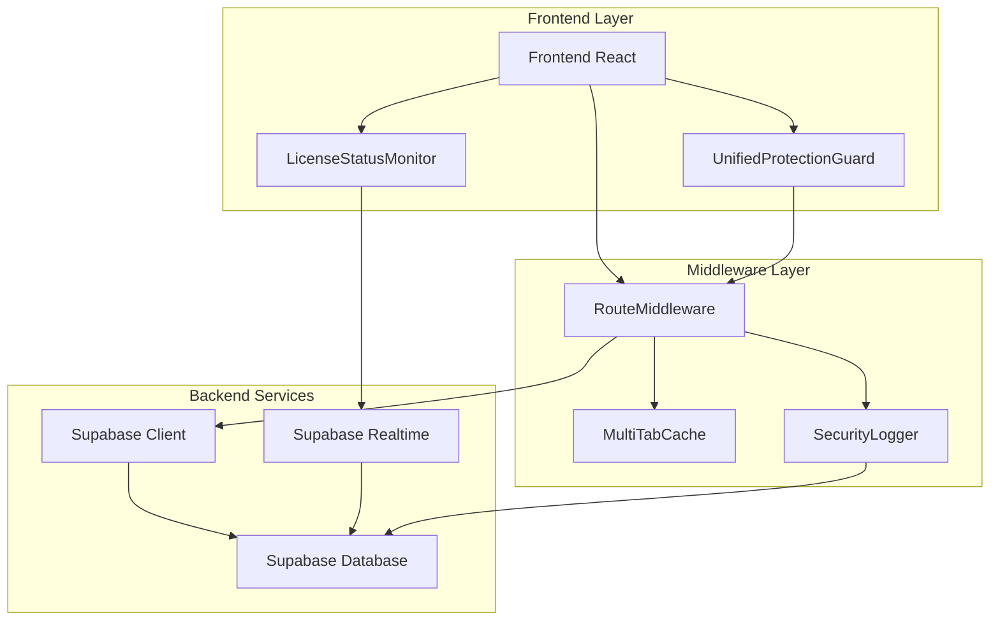
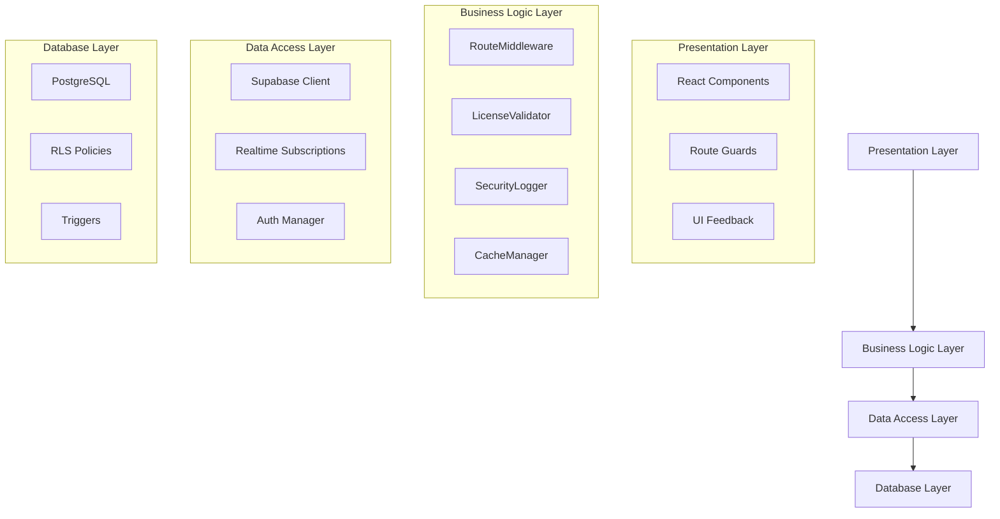
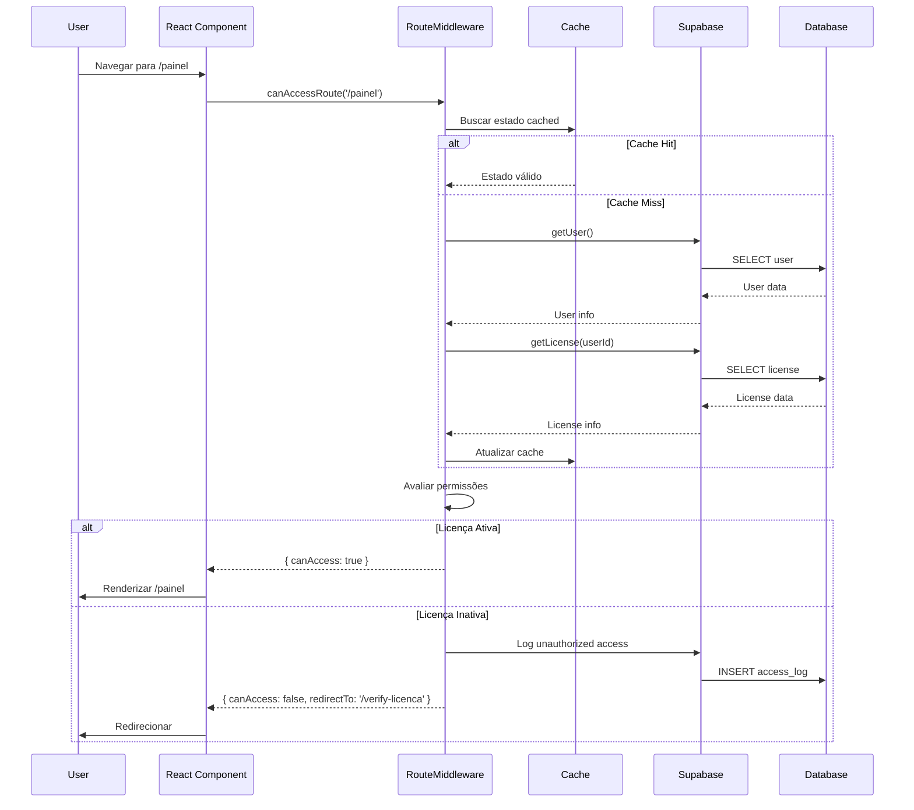
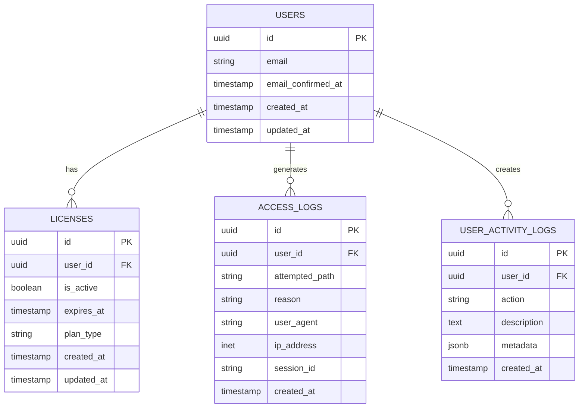

# Arquitetura Técnica - Sistema de Redirecionamento de Licença

## 1. Arquitetura Geral

### 1.1 Diagrama de Arquitetura



## 2. Descrição Tecnológica

- **Frontend**: React@18 + TypeScript + Tailwind CSS + Vite
- **Backend**: Supabase (PostgreSQL + Realtime + Auth)
- **Cache**: MultiTabCache (localStorage + sessionStorage)
- **Monitoramento**: Supabase Realtime + Custom Logger

## 3. Definições de Rotas

| Rota | Propósito | Proteção |
|------|-----------|----------|
| `/` | Página inicial | Pública |
| `/auth` | Autenticação | Pública |
| `/verify-licenca` | Verificação de licença | Requer autenticação |
| `/painel` | Dashboard principal | Requer licença ativa |
| `/dashboard` | Dashboard alternativo | Requer licença ativa |
| `/licenca` | Gerenciamento de licença | Requer autenticação |
| `/unauthorized` | Acesso negado | Pública |

## 4. Definições de API

### 4.1 APIs Core do Sistema

#### Verificação de Status de Licença
```typescript
// Método: routeMiddleware.canAccessRoute()
interface RouteAccessResult {
  canAccess: boolean;
  redirectTo?: string;
  reason?: string;
  licenseStatus?: 'active' | 'inactive' | 'expired' | 'not_found';
}

// Parâmetros
interface RouteAccessParams {
  path: string;
  forceRefresh?: boolean;
}
```

#### Verificação de Licença Detalhada
```typescript
// Método: checkLicenseStatus()
interface LicenseStatusResult {
  status: 'active' | 'inactive' | 'expired' | 'not_found';
  expiresAt?: string;
  lastCheck: number;
  userId: string;
}

// Parâmetros
interface LicenseCheckParams {
  userId: string;
  useCache?: boolean;
}
```

#### Log de Acesso Não Autorizado
```typescript
// Método: securityLogger.logUnauthorizedAccess()
interface UnauthorizedAccessLog {
  userId: string;
  attemptedPath: string;
  reason: string;
  userAgent?: string;
  sessionId?: string;
  timestamp: string;
}
```

### 4.2 APIs de Supabase

#### Consulta de Licenças
```sql
-- Verificar status da licença
SELECT 
  id,
  user_id,
  is_active,
  expires_at,
  created_at,
  updated_at
FROM licenses 
WHERE user_id = $1 
AND (expires_at IS NULL OR expires_at > NOW())
LIMIT 1;
```

#### Inserção de Logs de Acesso
```sql
-- Registrar tentativa de acesso não autorizado
INSERT INTO access_logs (
  user_id,
  attempted_path,
  reason,
  user_agent,
  ip_address,
  session_id
) VALUES ($1, $2, $3, $4, $5, $6);
```

#### Consulta de Atividades do Usuário
```sql
-- Buscar atividades recentes
SELECT 
  id,
  action,
  description,
  metadata,
  created_at
FROM user_activity_logs 
WHERE user_id = $1 
ORDER BY created_at DESC 
LIMIT 10;
```

## 5. Arquitetura do Servidor

### 5.1 Diagrama de Camadas



### 5.2 Fluxo de Dados



## 6. Modelo de Dados

### 6.1 Diagrama ER



### 6.2 DDL (Data Definition Language)

#### Tabela de Usuários (Supabase Auth)
```sql
-- Tabela gerenciada pelo Supabase Auth
-- auth.users já existe, apenas referenciamos
```

#### Tabela de Licenças
```sql
CREATE TABLE IF NOT EXISTS licenses (
    id UUID PRIMARY KEY DEFAULT gen_random_uuid(),
    user_id UUID REFERENCES auth.users(id) ON DELETE CASCADE,
    is_active BOOLEAN DEFAULT true,
    expires_at TIMESTAMP WITH TIME ZONE,
    plan_type VARCHAR(50) DEFAULT 'basic',
    created_at TIMESTAMP WITH TIME ZONE DEFAULT NOW(),
    updated_at TIMESTAMP WITH TIME ZONE DEFAULT NOW(),
    
    -- Constraints
    CONSTRAINT unique_user_license UNIQUE(user_id)
);

-- Índices para performance
CREATE INDEX IF NOT EXISTS idx_licenses_user_id ON licenses(user_id);
CREATE INDEX IF NOT EXISTS idx_licenses_is_active ON licenses(is_active);
CREATE INDEX IF NOT EXISTS idx_licenses_expires_at ON licenses(expires_at);

-- Trigger para updated_at
CREATE OR REPLACE FUNCTION update_updated_at_column()
RETURNS TRIGGER AS $$
BEGIN
    NEW.updated_at = NOW();
    RETURN NEW;
END;
$$ language 'plpgsql';

CREATE TRIGGER update_licenses_updated_at 
    BEFORE UPDATE ON licenses 
    FOR EACH ROW 
    EXECUTE FUNCTION update_updated_at_column();
```

#### Tabela de Logs de Acesso
```sql
CREATE TABLE IF NOT EXISTS access_logs (
    id UUID PRIMARY KEY DEFAULT gen_random_uuid(),
    user_id UUID REFERENCES auth.users(id) ON DELETE SET NULL,
    attempted_path VARCHAR(255) NOT NULL,
    reason VARCHAR(255) NOT NULL,
    user_agent TEXT,
    ip_address INET,
    session_id VARCHAR(255),
    created_at TIMESTAMP WITH TIME ZONE DEFAULT NOW()
);

-- Índices para consultas eficientes
CREATE INDEX IF NOT EXISTS idx_access_logs_user_id ON access_logs(user_id);
CREATE INDEX IF NOT EXISTS idx_access_logs_created_at ON access_logs(created_at DESC);
CREATE INDEX IF NOT EXISTS idx_access_logs_reason ON access_logs(reason);
CREATE INDEX IF NOT EXISTS idx_access_logs_attempted_path ON access_logs(attempted_path);

-- Particionamento por data (opcional para grandes volumes)
CREATE TABLE IF NOT EXISTS access_logs_2024 PARTITION OF access_logs
FOR VALUES FROM ('2024-01-01') TO ('2025-01-01');
```

#### Tabela de Logs de Atividade
```sql
CREATE TABLE IF NOT EXISTS user_activity_logs (
    id UUID PRIMARY KEY DEFAULT gen_random_uuid(),
    user_id UUID REFERENCES auth.users(id) ON DELETE CASCADE,
    action VARCHAR(100) NOT NULL,
    description TEXT,
    metadata JSONB,
    created_at TIMESTAMP WITH TIME ZONE DEFAULT NOW()
);

-- Índices
CREATE INDEX IF NOT EXISTS idx_user_activity_logs_user_id ON user_activity_logs(user_id);
CREATE INDEX IF NOT EXISTS idx_user_activity_logs_created_at ON user_activity_logs(created_at DESC);
CREATE INDEX IF NOT EXISTS idx_user_activity_logs_action ON user_activity_logs(action);

-- Índice GIN para consultas em metadata JSONB
CREATE INDEX IF NOT EXISTS idx_user_activity_logs_metadata ON user_activity_logs USING GIN(metadata);
```

#### Políticas RLS (Row Level Security)
```sql
-- Habilitar RLS
ALTER TABLE licenses ENABLE ROW LEVEL SECURITY;
ALTER TABLE access_logs ENABLE ROW LEVEL SECURITY;
ALTER TABLE user_activity_logs ENABLE ROW LEVEL SECURITY;

-- Políticas para licenses
CREATE POLICY "Users can view their own license" ON licenses
    FOR SELECT USING (auth.uid() = user_id);

CREATE POLICY "Users can update their own license" ON licenses
    FOR UPDATE USING (auth.uid() = user_id);

-- Políticas para access_logs
CREATE POLICY "Users can view their own access logs" ON access_logs
    FOR SELECT USING (auth.uid() = user_id);

CREATE POLICY "System can insert access logs" ON access_logs
    FOR INSERT WITH CHECK (true);

-- Políticas para user_activity_logs
CREATE POLICY "Users can view their own activity logs" ON user_activity_logs
    FOR SELECT USING (auth.uid() = user_id);

CREATE POLICY "System can insert activity logs" ON user_activity_logs
    FOR INSERT WITH CHECK (true);

-- Política para administradores (opcional)
CREATE POLICY "Admins can view all logs" ON access_logs
    FOR SELECT USING (
        EXISTS (
            SELECT 1 FROM licenses 
            WHERE user_id = auth.uid() 
            AND plan_type = 'admin'
        )
    );
```

#### Dados Iniciais
```sql
-- Inserir licenças de exemplo (para desenvolvimento)
INSERT INTO licenses (user_id, is_active, plan_type, expires_at)
SELECT 
    id,
    true,
    'basic',
    NOW() + INTERVAL '1 year'
FROM auth.users
WHERE email LIKE '%@example.com'
ON CONFLICT (user_id) DO NOTHING;

-- Inserir logs de atividade iniciais
INSERT INTO user_activity_logs (user_id, action, description)
SELECT 
    user_id,
    'license_created',
    'Licença inicial criada automaticamente'
FROM licenses
WHERE created_at > NOW() - INTERVAL '1 hour';
```

#### Views para Consultas Otimizadas
```sql
-- View para status completo do usuário
CREATE OR REPLACE VIEW user_status AS
SELECT 
    u.id,
    u.email,
    u.email_confirmed_at,
    l.is_active as license_active,
    l.expires_at as license_expires_at,
    l.plan_type,
    CASE 
        WHEN l.is_active = false THEN 'inactive'
        WHEN l.expires_at IS NOT NULL AND l.expires_at < NOW() THEN 'expired'
        WHEN l.is_active = true THEN 'active'
        ELSE 'not_found'
    END as license_status
FROM auth.users u
LEFT JOIN licenses l ON u.id = l.user_id;

-- View para estatísticas de acesso
CREATE OR REPLACE VIEW access_statistics AS
SELECT 
    DATE_TRUNC('day', created_at) as date,
    reason,
    COUNT(*) as attempts,
    COUNT(DISTINCT user_id) as unique_users
FROM access_logs
WHERE created_at > NOW() - INTERVAL '30 days'
GROUP BY DATE_TRUNC('day', created_at), reason
ORDER BY date DESC, attempts DESC;
```

#### Funções Stored Procedures
```sql
-- Função para verificar status da licença
CREATE OR REPLACE FUNCTION check_license_status(p_user_id UUID)
RETURNS TABLE(
    status TEXT,
    expires_at TIMESTAMP WITH TIME ZONE,
    plan_type VARCHAR(50)
) AS $$
BEGIN
    RETURN QUERY
    SELECT 
        CASE 
            WHEN l.is_active = false THEN 'inactive'
            WHEN l.expires_at IS NOT NULL AND l.expires_at < NOW() THEN 'expired'
            WHEN l.is_active = true THEN 'active'
            ELSE 'not_found'
        END::TEXT,
        l.expires_at,
        l.plan_type
    FROM licenses l
    WHERE l.user_id = p_user_id;
END;
$$ LANGUAGE plpgsql SECURITY DEFINER;

-- Função para log de acesso não autorizado
CREATE OR REPLACE FUNCTION log_unauthorized_access(
    p_user_id UUID,
    p_attempted_path VARCHAR(255),
    p_reason VARCHAR(255),
    p_user_agent TEXT DEFAULT NULL,
    p_session_id VARCHAR(255) DEFAULT NULL
) RETURNS UUID AS $$
DECLARE
    log_id UUID;
BEGIN
    INSERT INTO access_logs (
        user_id,
        attempted_path,
        reason,
        user_agent,
        session_id
    ) VALUES (
        p_user_id,
        p_attempted_path,
        p_reason,
        p_user_agent,
        p_session_id
    ) RETURNING id INTO log_id;
    
    RETURN log_id;
END;
$$ LANGUAGE plpgsql SECURITY DEFINER;
```

#### Triggers para Auditoria
```sql
-- Trigger para log automático de mudanças na licença
CREATE OR REPLACE FUNCTION log_license_changes()
RETURNS TRIGGER AS $$
BEGIN
    -- Log quando licença é desativada
    IF OLD.is_active = true AND NEW.is_active = false THEN
        INSERT INTO user_activity_logs (user_id, action, description, metadata)
        VALUES (
            NEW.user_id,
            'license_deactivated',
            'Licença foi desativada',
            jsonb_build_object(
                'old_status', 'active',
                'new_status', 'inactive',
                'changed_at', NOW()
            )
        );
    END IF;
    
    -- Log quando licença é reativada
    IF OLD.is_active = false AND NEW.is_active = true THEN
        INSERT INTO user_activity_logs (user_id, action, description, metadata)
        VALUES (
            NEW.user_id,
            'license_activated',
            'Licença foi reativada',
            jsonb_build_object(
                'old_status', 'inactive',
                'new_status', 'active',
                'changed_at', NOW()
            )
        );
    END IF;
    
    RETURN NEW;
END;
$$ LANGUAGE plpgsql;

CREATE TRIGGER license_changes_trigger
    AFTER UPDATE ON licenses
    FOR EACH ROW
    EXECUTE FUNCTION log_license_changes();
```

## 7. Configuração de Realtime

### 7.1 Configuração do Supabase Realtime
```sql
-- Habilitar realtime para a tabela licenses
ALTER PUBLICATION supabase_realtime ADD TABLE licenses;

-- Habilitar realtime para logs (opcional)
ALTER PUBLICATION supabase_realtime ADD TABLE user_activity_logs;
```

### 7.2 Configuração no Frontend
```typescript
// Configuração do cliente Supabase para Realtime
const supabase = createClient(supabaseUrl, supabaseAnonKey, {
  realtime: {
    params: {
      eventsPerSecond: 10
    }
  }
});

// Subscription para mudanças na licença
const subscribeLicenseChanges = (userId: string, callback: (payload: any) => void) => {
  return supabase
    .channel('license_changes')
    .on(
      'postgres_changes',
      {
        event: 'UPDATE',
        schema: 'public',
        table: 'licenses',
        filter: `user_id=eq.${userId}`
      },
      callback
    )
    .subscribe();
};
```

## 8. Configurações de Performance

### 8.1 Índices de Performance
```sql
-- Índices compostos para consultas frequentes
CREATE INDEX IF NOT EXISTS idx_licenses_user_active 
    ON licenses(user_id, is_active) 
    WHERE is_active = true;

CREATE INDEX IF NOT EXISTS idx_access_logs_user_date 
    ON access_logs(user_id, created_at DESC);

-- Índice parcial para logs recentes
CREATE INDEX IF NOT EXISTS idx_access_logs_recent 
    ON access_logs(created_at DESC) 
    WHERE created_at > NOW() - INTERVAL '7 days';
```

### 8.2 Configuração de Cache
```typescript
// Configuração otimizada do cache
const cacheConfig = {
  // TTL baseado no tipo de dados
  userSession: 15 * 60 * 1000,      // 15 minutos
  licenseStatus: 5 * 60 * 1000,     // 5 minutos
  routePermissions: 10 * 60 * 1000, // 10 minutos
  
  // Tamanhos máximos
  maxEntries: {
    userSession: 100,
    licenseStatus: 500,
    routePermissions: 1000
  },
  
  // Estratégias de limpeza
  cleanupStrategy: 'lru', // Least Recently Used
  cleanupInterval: 5 * 60 * 1000 // 5 minutos
};
```

## 9. Monitoramento e Métricas

### 9.1 Queries para Métricas
```sql
-- Métricas de tentativas de acesso não autorizado
SELECT 
    DATE_TRUNC('hour', created_at) as hour,
    reason,
    COUNT(*) as attempts
FROM access_logs 
WHERE created_at > NOW() - INTERVAL '24 hours'
GROUP BY hour, reason
ORDER BY hour DESC;

-- Usuários com licenças inativas tentando acessar
SELECT 
    u.email,
    COUNT(al.id) as failed_attempts,
    MAX(al.created_at) as last_attempt
FROM access_logs al
JOIN auth.users u ON al.user_id = u.id
WHERE al.reason = 'inactive_license'
AND al.created_at > NOW() - INTERVAL '7 days'
GROUP BY u.email
ORDER BY failed_attempts DESC;

-- Performance de verificações de licença
SELECT 
    AVG(EXTRACT(EPOCH FROM (lag_time))) as avg_response_time_seconds
FROM (
    SELECT 
        created_at - LAG(created_at) OVER (ORDER BY created_at) as lag_time
    FROM user_activity_logs 
    WHERE action = 'license_check'
    AND created_at > NOW() - INTERVAL '1 hour'
) t;
```

### 9.2 Alertas e Notificações
```sql
-- Função para detectar atividade suspeita
CREATE OR REPLACE FUNCTION detect_suspicious_activity()
RETURNS TABLE(
    user_id UUID,
    email TEXT,
    attempts_count BIGINT,
    last_attempt TIMESTAMP WITH TIME ZONE
) AS $$
BEGIN
    RETURN QUERY
    SELECT 
        al.user_id,
        u.email::TEXT,
        COUNT(al.id),
        MAX(al.created_at)
    FROM access_logs al
    JOIN auth.users u ON al.user_id = u.id
    WHERE al.created_at > NOW() - INTERVAL '1 hour'
    AND al.reason IN ('inactive_license', 'expired_license')
    GROUP BY al.user_id, u.email
    HAVING COUNT(al.id) > 10; -- Mais de 10 tentativas em 1 hora
END;
$$ LANGUAGE plpgsql SECURITY DEFINER;
```

Esta arquitetura técnica fornece uma base sólida para implementar o sistema de redirecionamento automático com foco em segurança, performance e escalabilidade.