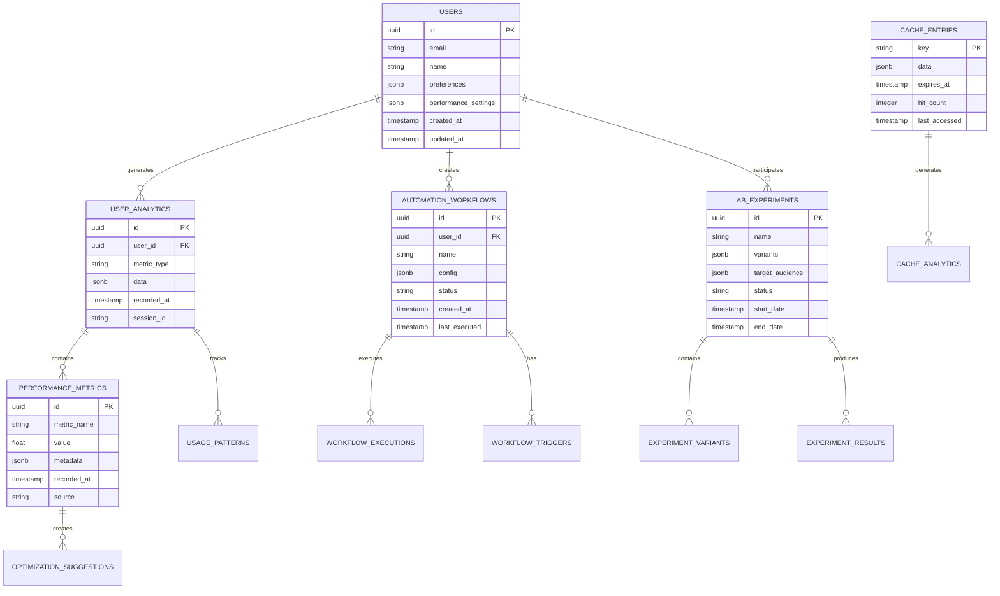

# Fase 4 - Otimização e Funcionalidades Avançadas - Arquitetura Técnica

## 1. Architecture Design


## 2. Technology Description

- **Frontend**: React@18 + TypeScript + Vite + PWA + React Query + Framer Motion
- **Caching**: Redis + React Query + Service Worker + CDN (Vercel Edge)
- **Backend**: Supabase + Edge Functions + PostgreSQL + Realtime
- **Analytics**: Custom Analytics Engine + Chart.js + D3.js
- **Testing**: Vitest + React Testing Library + Playwright + Storybook
- **Performance**: Web Vitals + Lighthouse CI + Bundle Analyzer
- **Monitoring**: Sentry + Custom Performance Monitor + Supabase Analytics

## 3. Route Definitions

| Route | Purpose | Optimization |
|-------|---------|-------------|
| /dashboard | Dashboard otimizado com widgets personalizáveis | Lazy loading, code splitting, cache inteligente |
| /analytics | Analytics avançados com visualizações interativas | Data streaming, virtual scrolling, memoization |
| /reports | Centro de relatórios com builder visual | Progressive loading, background processing |
| /automation | Centro de automação e workflows | Real-time updates, optimistic UI |
| /performance | Configurações de performance e monitoramento | Server-side rendering, edge caching |
| /testing | Painel de A/B testing e feature flags | Static generation, incremental updates |
| /docs | Documentação interativa e help system | Search indexing, content caching |
| /admin/advanced | Painel administrativo avançado | Role-based code splitting, permission caching |

## 4. API Definitions

### 4.1 Performance APIs

**Cache Management**
```
POST /api/cache/invalidate
```

Request:
| Param Name | Param Type | isRequired | Description |
|------------|------------|------------|-------------|
| cache_keys | string[] | true | Array de chaves de cache para invalidar |
| strategy | string | false | Estratégia de invalidação (immediate, scheduled) |

Response:
| Param Name | Param Type | Description |
|------------|------------|-------------|
| invalidated | number | Número de chaves invalidadas |
| status | string | Status da operação |

**Analytics Data**
```
GET /api/analytics/advanced
```

Request:
| Param Name | Param Type | isRequired | Description |
|------------|------------|------------|-------------|
| metric_type | string | true | Tipo de métrica (performance, user, business) |
| time_range | string | true | Período de análise (1h, 24h, 7d, 30d) |
| granularity | string | false | Granularidade dos dados (minute, hour, day) |

Response:
| Param Name | Param Type | Description |
|------------|------------|-------------|
| data | object[] | Array de pontos de dados |
| insights | object | Insights automatizados |
| predictions | object | Análises preditivas |

### 4.2 Automation APIs

**Workflow Management**
```
POST /api/automation/workflow
```

Request:
| Param Name | Param Type | isRequired | Description |
|------------|------------|------------|-------------|
| workflow_config | object | true | Configuração do workflow |
| trigger_conditions | object[] | true | Condições de trigger |
| actions | object[] | true | Ações a serem executadas |

Response:
| Param Name | Param Type | Description |
|------------|------------|-------------|
| workflow_id | string | ID único do workflow |
| status | string | Status de criação |

**A/B Testing**
```
POST /api/testing/experiment
```

Request:
| Param Name | Param Type | isRequired | Description |
|------------|------------|------------|-------------|
| experiment_name | string | true | Nome do experimento |
| variants | object[] | true | Variantes do teste |
| target_audience | object | true | Audiência alvo |
| success_metrics | string[] | true | Métricas de sucesso |

Response:
| Param Name | Param Type | Description |
|------------|------------|-------------|
| experiment_id | string | ID único do experimento |
| estimated_duration | number | Duração estimada em dias |

## 5. Server Architecture Diagram


## 6. Data Model

### 6.1 Data Model Definition



### 6.2 Data Definition Language

**Performance Metrics Table**
```sql
-- Create performance metrics table
CREATE TABLE performance_metrics (
    id UUID PRIMARY KEY DEFAULT gen_random_uuid(),
    metric_name VARCHAR(100) NOT NULL,
    value FLOAT NOT NULL,
    metadata JSONB DEFAULT '{}',
    recorded_at TIMESTAMP WITH TIME ZONE DEFAULT NOW(),
    source VARCHAR(50) NOT NULL,
    user_id UUID REFERENCES users(id),
    session_id VARCHAR(100)
);

-- Create indexes for performance
CREATE INDEX idx_performance_metrics_name ON performance_metrics(metric_name);
CREATE INDEX idx_performance_metrics_recorded_at ON performance_metrics(recorded_at DESC);
CREATE INDEX idx_performance_metrics_user_id ON performance_metrics(user_id);
CREATE INDEX idx_performance_metrics_source ON performance_metrics(source);

-- Create composite index for common queries
CREATE INDEX idx_performance_metrics_composite ON performance_metrics(metric_name, recorded_at DESC, user_id);
```

**User Analytics Table**
```sql
-- Create user analytics table
CREATE TABLE user_analytics (
    id UUID PRIMARY KEY DEFAULT gen_random_uuid(),
    user_id UUID REFERENCES users(id) ON DELETE CASCADE,
    metric_type VARCHAR(50) NOT NULL,
    data JSONB NOT NULL DEFAULT '{}',
    recorded_at TIMESTAMP WITH TIME ZONE DEFAULT NOW(),
    session_id VARCHAR(100),
    page_url TEXT,
    user_agent TEXT
);

-- Create indexes
CREATE INDEX idx_user_analytics_user_id ON user_analytics(user_id);
CREATE INDEX idx_user_analytics_metric_type ON user_analytics(metric_type);
CREATE INDEX idx_user_analytics_recorded_at ON user_analytics(recorded_at DESC);
CREATE INDEX idx_user_analytics_session_id ON user_analytics(session_id);

-- Create partitioned table for better performance
CREATE TABLE user_analytics_partitioned (
    LIKE user_analytics INCLUDING ALL
) PARTITION BY RANGE (recorded_at);
```

**Automation Workflows Table**
```sql
-- Create automation workflows table
CREATE TABLE automation_workflows (
    id UUID PRIMARY KEY DEFAULT gen_random_uuid(),
    user_id UUID REFERENCES users(id) ON DELETE CASCADE,
    name VARCHAR(200) NOT NULL,
    description TEXT,
    config JSONB NOT NULL DEFAULT '{}',
    triggers JSONB NOT NULL DEFAULT '[]',
    actions JSONB NOT NULL DEFAULT '[]',
    status VARCHAR(20) DEFAULT 'active' CHECK (status IN ('active', 'paused', 'disabled')),
    created_at TIMESTAMP WITH TIME ZONE DEFAULT NOW(),
    updated_at TIMESTAMP WITH TIME ZONE DEFAULT NOW(),
    last_executed TIMESTAMP WITH TIME ZONE,
    execution_count INTEGER DEFAULT 0
);

-- Create indexes
CREATE INDEX idx_automation_workflows_user_id ON automation_workflows(user_id);
CREATE INDEX idx_automation_workflows_status ON automation_workflows(status);
CREATE INDEX idx_automation_workflows_last_executed ON automation_workflows(last_executed DESC);
```

**A/B Experiments Table**
```sql
-- Create A/B experiments table
CREATE TABLE ab_experiments (
    id UUID PRIMARY KEY DEFAULT gen_random_uuid(),
    name VARCHAR(200) NOT NULL,
    description TEXT,
    variants JSONB NOT NULL DEFAULT '[]',
    target_audience JSONB NOT NULL DEFAULT '{}',
    success_metrics JSONB NOT NULL DEFAULT '[]',
    status VARCHAR(20) DEFAULT 'draft' CHECK (status IN ('draft', 'running', 'completed', 'paused')),
    confidence_level FLOAT DEFAULT 0.95,
    start_date TIMESTAMP WITH TIME ZONE,
    end_date TIMESTAMP WITH TIME ZONE,
    created_at TIMESTAMP WITH TIME ZONE DEFAULT NOW(),
    created_by UUID REFERENCES users(id)
);

-- Create indexes
CREATE INDEX idx_ab_experiments_status ON ab_experiments(status);
CREATE INDEX idx_ab_experiments_start_date ON ab_experiments(start_date DESC);
CREATE INDEX idx_ab_experiments_created_by ON ab_experiments(created_by);
```

**Cache Analytics Table**
```sql
-- Create cache analytics table
CREATE TABLE cache_analytics (
    id UUID PRIMARY KEY DEFAULT gen_random_uuid(),
    cache_key VARCHAR(255) NOT NULL,
    operation VARCHAR(20) NOT NULL CHECK (operation IN ('hit', 'miss', 'set', 'delete', 'expire')),
    response_time_ms INTEGER,
    data_size_bytes INTEGER,
    recorded_at TIMESTAMP WITH TIME ZONE DEFAULT NOW(),
    user_id UUID REFERENCES users(id),
    endpoint VARCHAR(255)
);

-- Create indexes for cache analytics
CREATE INDEX idx_cache_analytics_cache_key ON cache_analytics(cache_key);
CREATE INDEX idx_cache_analytics_operation ON cache_analytics(operation);
CREATE INDEX idx_cache_analytics_recorded_at ON cache_analytics(recorded_at DESC);
CREATE INDEX idx_cache_analytics_endpoint ON cache_analytics(endpoint);

-- Create materialized view for cache performance
CREATE MATERIALIZED VIEW cache_performance_summary AS
SELECT 
    cache_key,
    COUNT(*) as total_operations,
    COUNT(*) FILTER (WHERE operation = 'hit') as hits,
    COUNT(*) FILTER (WHERE operation = 'miss') as misses,
    ROUND(COUNT(*) FILTER (WHERE operation = 'hit')::numeric / COUNT(*)::numeric * 100, 2) as hit_ratio,
    AVG(response_time_ms) as avg_response_time,
    MAX(recorded_at) as last_accessed
FROM cache_analytics 
WHERE recorded_at >= NOW() - INTERVAL '24 hours'
GROUP BY cache_key;

-- Create index on materialized view
CREATE INDEX idx_cache_performance_summary_hit_ratio ON cache_performance_summary(hit_ratio DESC);
```

**Performance Optimization Functions**
```sql
-- Function to get performance insights
CREATE OR REPLACE FUNCTION get_performance_insights(
    p_time_range INTERVAL DEFAULT '24 hours',
    p_metric_types TEXT[] DEFAULT ARRAY['page_load', 'api_response', 'cache_hit']
)
RETURNS TABLE (
    metric_name TEXT,
    avg_value NUMERIC,
    min_value NUMERIC,
    max_value NUMERIC,
    trend_direction TEXT,
    recommendations TEXT[]
) AS $$
BEGIN
    RETURN QUERY
    SELECT 
        pm.metric_name::TEXT,
        ROUND(AVG(pm.value)::numeric, 2) as avg_value,
        ROUND(MIN(pm.value)::numeric, 2) as min_value,
        ROUND(MAX(pm.value)::numeric, 2) as max_value,
        CASE 
            WHEN AVG(pm.value) > LAG(AVG(pm.value)) OVER (ORDER BY pm.metric_name) THEN 'increasing'
            WHEN AVG(pm.value) < LAG(AVG(pm.value)) OVER (ORDER BY pm.metric_name) THEN 'decreasing'
            ELSE 'stable'
        END::TEXT as trend_direction,
        ARRAY[
            CASE WHEN AVG(pm.value) > 1000 THEN 'Consider caching optimization' END,
            CASE WHEN COUNT(*) < 10 THEN 'Insufficient data for analysis' END
        ]::TEXT[] as recommendations
    FROM performance_metrics pm
    WHERE pm.recorded_at >= NOW() - p_time_range
    AND pm.metric_name = ANY(p_metric_types)
    GROUP BY pm.metric_name;
END;
$$ LANGUAGE plpgsql;
```