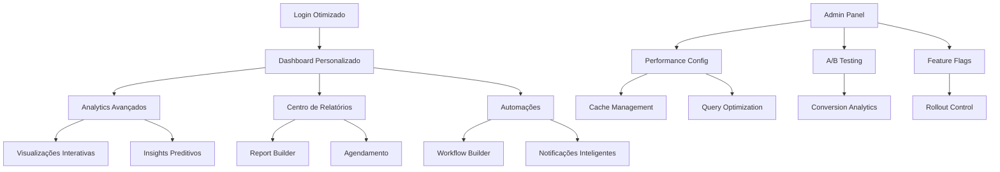

# Fase 4 - Otimização e Funcionalidades Avançadas - PRD

## 1. Product Overview

A Fase 4 representa a evolução final do sistema de licenciamento, focando em otimizações de performance, melhorias significativas na experiência do usuário e implementação de funcionalidades avançadas que elevam o produto a um nível enterprise.

Esta fase visa transformar o sistema em uma solução robusta, escalável e altamente otimizada, proporcionando uma experiência excepcional aos usuários finais e administradores, com capacidades analíticas avançadas e automações inteligentes.

## 2. Core Features

### 2.1 User Roles

| Role | Registration Method | Core Permissions |
|------|---------------------|------------------|
| Usuário Final | Registro padrão | Acesso otimizado às funcionalidades básicas |
| Usuário Premium | Upgrade de licença | Acesso a analytics avançados e relatórios |
| Administrador | Acesso administrativo | Controle total, analytics empresariais, automações |
| Super Admin | Acesso de sistema | Configurações avançadas, testes A/B, métricas de sistema |

### 2.2 Feature Module

Nossa solução otimizada consiste nas seguintes páginas principais:

1. **Dashboard Otimizado**: interface redesenhada, widgets personalizáveis, carregamento inteligente
2. **Analytics Avançados**: métricas detalhadas, visualizações interativas, insights automatizados
3. **Centro de Relatórios**: relatórios personalizados, exportação avançada, agendamento automático
4. **Configurações de Performance**: cache management, otimizações de sistema, monitoramento
5. **Centro de Automação**: workflows automatizados, triggers inteligentes, notificações personalizadas
6. **Painel de Testes**: A/B testing, feature flags, métricas de conversão
7. **Documentação Interativa**: guias contextuais, tutoriais interativos, sistema de ajuda avançado

### 2.3 Page Details

| Page Name | Module Name | Feature description |
|-----------|-------------|---------------------|
| Dashboard Otimizado | Widget Engine | Widgets personalizáveis com drag-and-drop, lazy loading, cache inteligente |
| Dashboard Otimizado | Performance Monitor | Métricas de performance em tempo real, alertas de degradação |
| Dashboard Otimizado | Quick Actions | Ações rápidas contextuais, shortcuts personalizáveis |
| Analytics Avançados | Data Visualization | Gráficos interativos, drill-down capabilities, exportação de dados |
| Analytics Avançados | Predictive Analytics | Análises preditivas, tendências, forecasting |
| Analytics Avançados | Custom Metrics | Métricas personalizadas, KPIs configuráveis, alertas inteligentes |
| Centro de Relatórios | Report Builder | Construtor visual de relatórios, templates pré-definidos |
| Centro de Relatórios | Scheduled Reports | Agendamento automático, distribuição por email, formatos múltiplos |
| Centro de Relatórios | Data Export | Exportação avançada (PDF, Excel, CSV), compressão automática |
| Configurações de Performance | Cache Management | Controle de cache, invalidação inteligente, otimização automática |
| Configurações de Performance | Query Optimization | Análise de queries, sugestões de otimização, indexação automática |
| Configurações de Performance | Resource Monitor | Monitoramento de recursos, alertas de capacidade, scaling automático |
| Centro de Automação | Workflow Builder | Construtor visual de workflows, triggers condicionais |
| Centro de Automação | Smart Notifications | Notificações inteligentes, personalização avançada, canais múltiplos |
| Centro de Automação | Integration Hub | Integrações com sistemas externos, APIs personalizadas |
| Painel de Testes | A/B Testing | Testes A/B automatizados, análise estatística, rollback automático |
| Painel de Testes | Feature Flags | Controle de features, rollout gradual, targeting de usuários |
| Painel de Testes | Conversion Analytics | Métricas de conversão, funil de vendas, otimização de UX |
| Documentação Interativa | Contextual Help | Ajuda contextual, tooltips inteligentes, guias passo-a-passo |
| Documentação Interativa | Interactive Tutorials | Tutoriais interativos, onboarding personalizado, progress tracking |
| Documentação Interativa | Knowledge Base | Base de conhecimento searchable, categorização automática |

## 3. Core Process

### Fluxo do Usuário Final Otimizado
1. Login com autenticação otimizada e cache de sessão
2. Dashboard personalizado carrega com lazy loading inteligente
3. Acesso a funcionalidades com feedback visual aprimorado
4. Analytics em tempo real com visualizações interativas
5. Relatórios personalizados com exportação automática

### Fluxo do Administrador Avançado
1. Painel administrativo com métricas de sistema em tempo real
2. Configuração de automações e workflows
3. Análise de performance e otimizações
4. Gestão de testes A/B e feature flags
5. Monitoramento de métricas empresariais

## 4. User Interface Design

### 4.1 Design Style

- **Cores Primárias**: Azul moderno (#2563EB), Verde sucesso (#10B981), Cinza neutro (#6B7280)
- **Cores Secundárias**: Roxo analytics (#8B5CF6), Laranja alertas (#F59E0B), Vermelho crítico (#EF4444)
- **Estilo de Botões**: Design system moderno com estados hover/focus aprimorados, micro-interações
- **Tipografia**: Inter para interface, JetBrains Mono para código, tamanhos responsivos (14px-18px base)
- **Layout**: Grid system flexível, componentes modulares, spacing consistente (8px base)
- **Ícones**: Lucide React com animações sutis, consistência visual, tamanhos padronizados
- **Animações**: Transições suaves (200-300ms), loading states inteligentes, feedback visual imediato

### 4.2 Page Design Overview

| Page Name | Module Name | UI Elements |
|-----------|-------------|-------------|
| Dashboard Otimizado | Widget Engine | Cards modulares com drag-and-drop, skeleton loading, micro-interações |
| Dashboard Otimizado | Performance Monitor | Gráficos em tempo real, indicadores de status, alertas visuais |
| Analytics Avançados | Data Visualization | Charts interativos (Chart.js/D3), tooltips contextuais, zoom/pan |
| Analytics Avançados | Predictive Analytics | Visualizações de tendências, confidence intervals, forecasting charts |
| Centro de Relatórios | Report Builder | Interface drag-and-drop, preview em tempo real, templates visuais |
| Centro de Relatórios | Scheduled Reports | Calendário interativo, status indicators, progress bars |
| Configurações de Performance | Cache Management | Métricas visuais, controles toggle, status em tempo real |
| Centro de Automação | Workflow Builder | Canvas visual, conectores drag-and-drop, preview de fluxo |
| Painel de Testes | A/B Testing | Comparações side-by-side, métricas de performance, confidence scores |
| Documentação Interativa | Contextual Help | Overlays contextuais, highlights interativos, progress indicators |

### 4.3 Responsividade

- **Desktop-first** com adaptação mobile otimizada
- **Breakpoints**: 320px (mobile), 768px (tablet), 1024px (desktop), 1440px (large)
- **Touch optimization** para dispositivos móveis com gestos intuitivos
- **Progressive enhancement** com fallbacks para funcionalidades avançadas
- **Performance-first** com lazy loading e code splitting por dispositivo