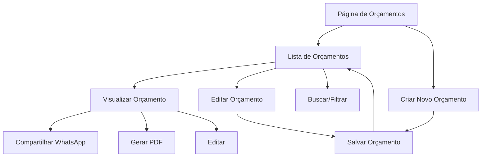

# Documentação de Requisitos - Sistema de Orçamentos

## 1. Visão Geral do Produto

O Sistema de Orçamentos é uma funcionalidade independente que permite aos usuários criar, gerenciar, compartilhar e gerar PDFs de orçamentos para serviços de reparo de dispositivos eletrônicos. Atualmente integrado como parte do dashboard, será extraído para uma rota independente `/orcamento` mantendo todas as funcionalidades existentes.

O sistema resolve o problema de gestão eficiente de orçamentos para oficinas de reparo, permitindo comunicação rápida com clientes via WhatsApp e documentação profissional através de PDFs.

## 2. Funcionalidades Principais

### 2.1 Papéis de Usuário

| Papel | Método de Registro | Permissões Principais |
|-------|-------------------|----------------------|
| Usuário Autenticado | Email + verificação | Criar, editar, visualizar e compartilhar orçamentos próprios |
| Administrador | Convite + permissões especiais | Gerenciar todos os orçamentos e configurações do sistema |

### 2.2 Módulos de Funcionalidade

O sistema de orçamentos consiste nas seguintes páginas principais:

1. **Lista de Orçamentos**: visualização em cards, busca e filtros, ações em lote
2. **Criar Orçamento**: formulário de criação, validação de dados, salvamento automático
3. **Visualizar Orçamento**: detalhes completos, ações de compartilhamento e edição
4. **Editar Orçamento**: modificação de dados existentes, histórico de alterações

### 2.3 Detalhes das Páginas

| Nome da Página | Nome do Módulo | Descrição da Funcionalidade |
|----------------|----------------|-----------------------------|
| Lista de Orçamentos | Lista Principal | Exibir orçamentos em cards responsivos, busca por cliente/dispositivo, filtros por status, seleção múltipla para ações em lote |
| Lista de Orçamentos | Barra de Busca | Busca em tempo real por nome do cliente, modelo do dispositivo, tipo de reparo |
| Lista de Orçamentos | Ações em Lote | Deletar múltiplos orçamentos, exportar selecionados |
| Criar Orçamento | Formulário de Criação | Campos para dados do cliente, dispositivo, serviços, preços, validação em tempo real |
| Criar Orçamento | Salvamento Automático | Salvar rascunhos automaticamente, recuperar dados em caso de falha |
| Visualizar Orçamento | Detalhes Completos | Mostrar todas as informações do orçamento, status, datas |
| Visualizar Orçamento | Ações de Compartilhamento | Compartilhar via WhatsApp, gerar e baixar PDF, copiar orçamento |
| Editar Orçamento | Formulário de Edição | Modificar dados existentes, manter histórico de alterações |
| Editar Orçamento | Validação | Validar alterações, confirmar salvamento |

## 3. Fluxo Principal de Processos

### Fluxo do Usuário Regular:
1. Acessa a rota `/orcamento`
2. Visualiza lista de orçamentos existentes
3. Pode criar novo orçamento ou editar existente
4. Compartilha orçamento via WhatsApp ou gera PDF
5. Gerencia orçamentos através de busca e filtros

### Fluxo do Administrador:
1. Acesso completo a todos os orçamentos
2. Configurações avançadas do sistema
3. Relatórios e estatísticas

## 4. Design da Interface do Usuário

### 4.1 Estilo de Design

- **Cores Primárias**: Azul (#3b82f6) e Verde (#10b981) para ações principais
- **Cores Secundárias**: Cinza (#6b7280) para textos secundários
- **Estilo de Botões**: Arredondados com efeitos hover e transições suaves
- **Fonte**: Inter ou system fonts, tamanhos de 14px a 24px
- **Layout**: Design baseado em cards com navegação superior
- **Ícones**: Lucide React icons para consistência

### 4.2 Visão Geral do Design das Páginas

| Nome da Página | Nome do Módulo | Elementos da UI |
|----------------|----------------|----------------|
| Lista de Orçamentos | Cards de Orçamento | Layout em grid responsivo, cards com sombra sutil, badges de status coloridos, botões de ação com ícones |
| Lista de Orçamentos | Barra de Busca | Input com ícone de busca, botão de limpar, filtros dropdown |
| Criar/Editar Orçamento | Formulário | Layout em duas colunas no desktop, campos agrupados logicamente, validação visual em tempo real |
| Visualizar Orçamento | Modal/Página de Detalhes | Layout limpo com informações organizadas em seções, botões de ação destacados |

### 4.3 Responsividade

O sistema é mobile-first com adaptação para desktop:
- **Mobile**: Layout em coluna única, navegação por tabs
- **Tablet**: Layout híbrido com sidebar colapsável
- **Desktop**: Layout completo com sidebar fixa e múltiplas colunas
- **Touch**: Otimizado para interações touch em dispositivos móveis

## 5. Funcionalidades Técnicas Específicas

### 5.1 Compartilhamento via WhatsApp
- Geração automática de mensagem formatada
- Abertura do WhatsApp Web ou aplicativo nativo
- Template personalizável de mensagem
- Inclusão de dados do orçamento na mensagem

### 5.2 Geração de PDF
- Criação de PDF com layout profissional
- Inclusão de logo e dados da empresa
- Formatação responsiva para impressão
- Download automático ou visualização no navegador

### 5.3 Busca e Filtros
- Busca em tempo real sem necessidade de submit
- Filtros por status, data, valor
- Persistência de filtros na sessão
- Limpeza rápida de filtros

### 5.4 Sincronização em Tempo Real
- Atualizações automáticas via Supabase subscriptions
- Debounce para evitar múltiplas atualizações
- Indicadores visuais de carregamento
- Tratamento de erros de conexão
