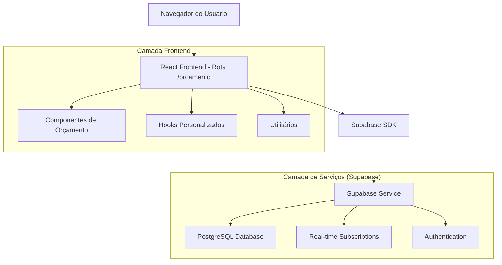
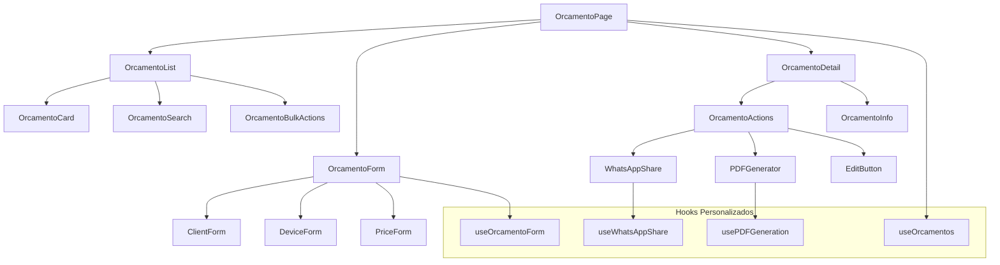
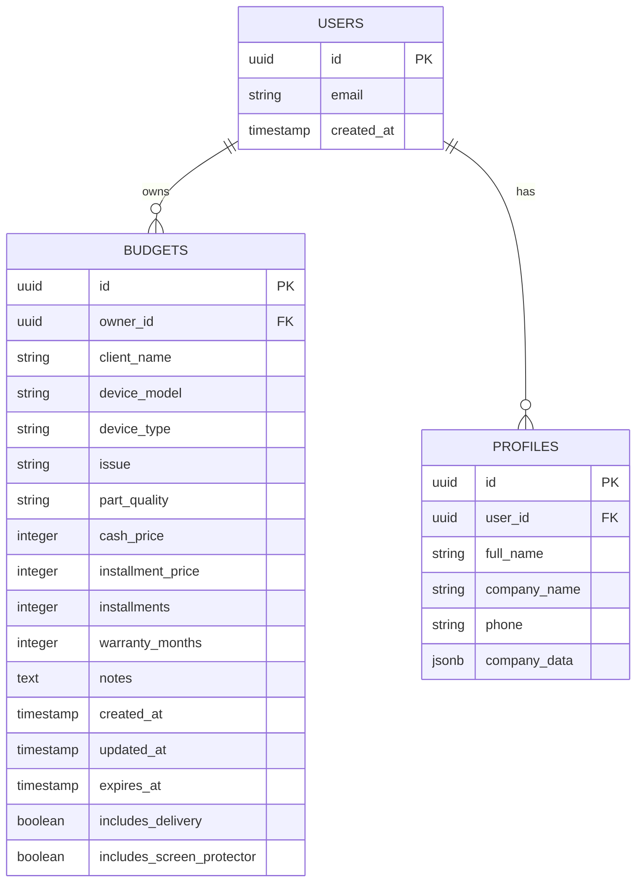

# Arquitetura Técnica - Sistema de Orçamentos

## 1. Design da Arquitetura



## 2. Descrição das Tecnologias

- **Frontend**: React@18 + TypeScript + Tailwind CSS + Vite
- **Backend**: Supabase (PostgreSQL + Real-time + Auth)
- **Roteamento**: React Router v6
- **Estado**: React Hooks + Context API
- **UI Components**: Shadcn/ui + Lucide React
- **Utilitários**: WhatsApp Utils + PDF Utils

## 3. Definições de Rotas

| Rota | Propósito |
|------|----------|
| /orcamento | Página principal de orçamentos com lista e navegação |
| /orcamento/novo | Formulário para criar novo orçamento |
| /orcamento/:id | Visualização detalhada de um orçamento específico |
| /orcamento/:id/editar | Formulário de edição de orçamento existente |

## 4. Definições de API

### 4.1 APIs Principais do Supabase

**Buscar orçamentos do usuário**
```typescript
supabase
  .from('budgets')
  .select('*')
  .eq('owner_id', userId)
  .order('created_at', { ascending: false })
```

**Criar novo orçamento**
```typescript
supabase
  .from('budgets')
  .insert({
    owner_id: string,
    client_name: string,
    device_model: string,
    device_type: string,
    issue: string,
    part_quality: string,
    cash_price: number,
    installment_price?: number,
    installments?: number,
    warranty_months?: number,
    notes?: string
  })
```

**Atualizar orçamento**
```typescript
supabase
  .from('budgets')
  .update(budgetData)
  .eq('id', budgetId)
  .eq('owner_id', userId)
```

**Deletar orçamento**
```typescript
supabase
  .from('budgets')
  .delete()
  .eq('id', budgetId)
  .eq('owner_id', userId)
```

### 4.2 Tipos TypeScript

```typescript
interface Budget {
  id: string;
  owner_id: string;
  client_name: string;
  device_model: string;
  device_type: string;
  issue: string;
  part_quality: string;
  cash_price: number;
  installment_price?: number;
  installments?: number;
  warranty_months?: number;
  notes?: string;
  created_at: string;
  updated_at: string;
  expires_at?: string;
  includes_delivery?: boolean;
  includes_screen_protector?: boolean;
}

interface BudgetFormData {
  client_name: string;
  device_model: string;
  device_type: string;
  issue: string;
  part_quality: string;
  cash_price: number;
  installment_price?: number;
  installments?: number;
  warranty_months?: number;
  notes?: string;
}
```

## 5. Arquitetura de Componentes



## 6. Modelo de Dados

### 6.1 Definição do Modelo de Dados



### 6.2 Linguagem de Definição de Dados (DDL)

**Tabela de Orçamentos (budgets)**
```sql
-- A tabela já existe, mas aqui está a estrutura para referência
CREATE TABLE budgets (
    id UUID PRIMARY KEY DEFAULT gen_random_uuid(),
    owner_id UUID NOT NULL REFERENCES auth.users(id) ON DELETE CASCADE,
    client_name VARCHAR(255) NOT NULL,
    device_model VARCHAR(255) NOT NULL,
    device_type VARCHAR(100) NOT NULL,
    issue TEXT NOT NULL,
    part_quality VARCHAR(100) NOT NULL,
    cash_price INTEGER NOT NULL, -- em centavos
    installment_price INTEGER,
    installments INTEGER DEFAULT 1,
    warranty_months INTEGER,
    notes TEXT,
    created_at TIMESTAMP WITH TIME ZONE DEFAULT NOW(),
    updated_at TIMESTAMP WITH TIME ZONE DEFAULT NOW(),
    expires_at TIMESTAMP WITH TIME ZONE,
    includes_delivery BOOLEAN DEFAULT FALSE,
    includes_screen_protector BOOLEAN DEFAULT FALSE
);

-- Índices para performance
CREATE INDEX idx_budgets_owner_id ON budgets(owner_id);
CREATE INDEX idx_budgets_created_at ON budgets(created_at DESC);
CREATE INDEX idx_budgets_client_name ON budgets(client_name);
CREATE INDEX idx_budgets_device_model ON budgets(device_model);

-- RLS (Row Level Security)
ALTER TABLE budgets ENABLE ROW LEVEL SECURITY;

-- Política para usuários autenticados
CREATE POLICY "Users can manage their own budgets" ON budgets
    FOR ALL USING (auth.uid() = owner_id);

-- Permissões para roles
GRANT SELECT ON budgets TO anon;
GRANT ALL PRIVILEGES ON budgets TO authenticated;
```

## 7. Estrutura de Arquivos Proposta

```
src/
├── pages/
│   └── orcamento/
│       ├── OrcamentoPage.tsx          # Página principal
│       ├── OrcamentoListPage.tsx      # Lista de orçamentos
│       ├── OrcamentoFormPage.tsx      # Criar/Editar
│       └── OrcamentoDetailPage.tsx    # Visualizar detalhes
├── components/
│   └── orcamento/
│       ├── OrcamentoCard.tsx          # Card individual
│       ├── OrcamentoList.tsx          # Lista de cards
│       ├── OrcamentoForm.tsx          # Formulário
│       ├── OrcamentoSearch.tsx        # Busca e filtros
│       ├── OrcamentoActions.tsx       # Ações (WhatsApp, PDF)
│       └── OrcamentoBulkActions.tsx   # Ações em lote
├── hooks/
│   └── orcamento/
│       ├── useOrcamentos.ts           # Gerenciar lista
│       ├── useOrcamentoForm.ts        # Formulário
│       ├── useOrcamentoActions.ts     # Ações
│       └── useOrcamentoSearch.ts      # Busca
└── utils/
    ├── orcamentoUtils.ts              # Utilitários gerais
    ├── whatsappUtils.ts               # Compartilhamento
    └── pdfUtils.ts                    # Geração de PDF
```

## 8. Implementação da Nova Rota

### 8.1 Adição no App.tsx

```typescript
// Adicionar import
import { OrcamentoPage } from './pages/orcamento/OrcamentoPage';

// Adicionar rota no Routes
<Route 
  path="/orcamento/*" 
  element={
    <UnifiedProtectionGuard>
      <OrcamentoPage />
    </UnifiedProtectionGuard>
  } 
/>
```

### 8.2 Atualização do routeConfig.ts

```typescript
// Adicionar nas rotas que requerem autenticação
authRequiredRoutes: [
  // ... rotas existentes
  '/orcamento',
  '/orcamento/*'
],

// Adicionar nas rotas que requerem licença
licenseRequiredRoutes: [
  // ... rotas existentes
  '/orcamento',
  '/orcamento/*'
]
```

### 8.3 Componente Principal OrcamentoPage

```typescript
import React from 'react';
import { Routes, Route } from 'react-router-dom';
import { OrcamentoListPage } from './OrcamentoListPage';
import { OrcamentoFormPage } from './OrcamentoFormPage';
import { OrcamentoDetailPage } from './OrcamentoDetailPage';

export const OrcamentoPage = () => {
  return (
    <Routes>
      <Route index element={<OrcamentoListPage />} />
      <Route path="novo" element={<OrcamentoFormPage />} />
      <Route path=":id" element={<OrcamentoDetailPage />} />
      <Route path=":id/editar" element={<OrcamentoFormPage />} />
    </Routes>
  );
};
```

## 9. Migração dos Componentes Existentes

### 9.1 Componentes a Reutilizar
- `BudgetLiteCard` → `OrcamentoCard`
- `BudgetLiteList` → `OrcamentoList`
- `BudgetLiteSearch` → `OrcamentoSearch`
- `NewBudgetLite` → `OrcamentoForm`
- `BudgetViewLite` → `OrcamentoDetail`

### 9.2 Hooks a Reutilizar
- `useBudgetData` → `useOrcamentos`
- `useBudgetDeletion` → `useOrcamentoActions`
- Utilitários de WhatsApp e PDF permanecem os mesmos

### 9.3 Considerações de Migração
- Manter compatibilidade com dados existentes
- Reutilizar lógica de negócio existente
- Adaptar componentes para nova estrutura de rotas
- Manter funcionalidades de real-time e cache
