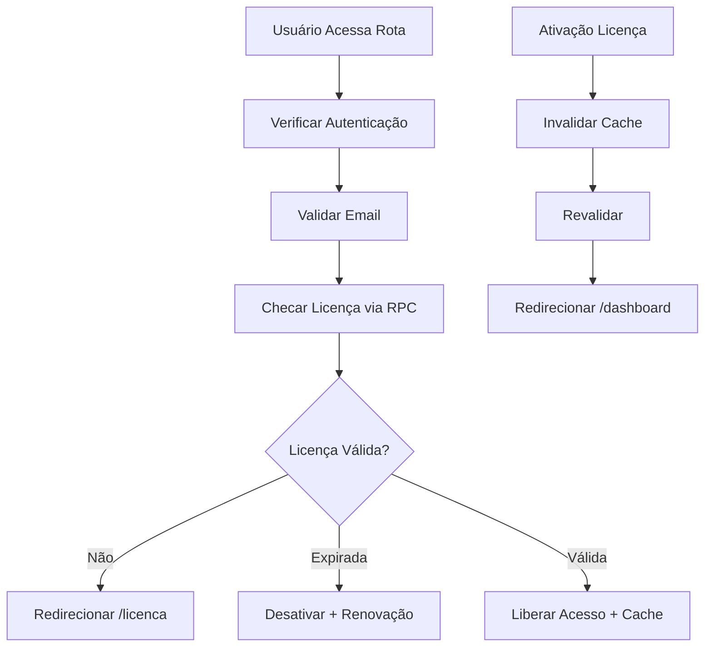

# Plano de Melhoria – Sistema de Licenciamento

## 1. Análise dos Problemas Identificados

### 1.1 Build Crítico
- **Erros TypeScript**: Múltiplos componentes com tipos inconsistentes
- **RPCs Inexistentes**: Chamadas para funções não implementadas ou removidas
- **Interfaces Incompletas**: Tipos parciais causando falhas de compilação
- **Imports Removidos**: Referências a módulos como `useSecurity` que não existem mais

### 1.2 Sistema de Licenças
- **Loops de Redirecionamento**: AuthGuard e ProtectedRoute criam redundância e conflitos
- **Validações Duplicadas**: Múltiplos hooks executando a mesma lógica
- **Cache Inconsistente**: Dados obsoletos causando comportamentos inesperados
- **RPC Problemática**: `validate_user_license_complete` com implementação inadequada

### 1.3 Estrutura da Tabela Licenses
```sql
CREATE TABLE licenses (
  id UUID PRIMARY KEY DEFAULT gen_random_uuid(),
  code TEXT UNIQUE NOT NULL,
  user_id UUID REFERENCES auth.users(id),
  expires_at TIMESTAMP WITH TIME ZONE,
  created_at TIMESTAMP WITH TIME ZONE DEFAULT NOW(),
  is_active BOOLEAN DEFAULT FALSE,
  activated_at TIMESTAMP WITH TIME ZONE,
  last_validation TIMESTAMP WITH TIME ZONE
);
```

## 2. Arquitetura da Solução Proposta

### 2.1 Fluxo Ideal de Validação


### 2.2 Componentes da Arquitetura

#### RPC Robusta
```sql
CREATE OR REPLACE FUNCTION validate_user_license_complete(p_user_id UUID)
RETURNS JSONB AS $$
DECLARE 
  l RECORD;
BEGIN
  SELECT * INTO l FROM licenses 
  WHERE user_id = p_user_id AND is_active = TRUE 
  ORDER BY activated_at DESC NULLS LAST, created_at DESC LIMIT 1;

  IF l IS NULL THEN
    RETURN jsonb_build_object(
      'has_license', false,
      'is_valid', false,
      'message', 'Nenhuma licença ativa',
      'requires_activation', true
    );
  END IF;

  IF l.expires_at IS NOT NULL AND l.expires_at < NOW() THEN
    UPDATE licenses SET is_active = FALSE, last_validation = NOW() WHERE id = l.id;
    RETURN jsonb_build_object(
      'has_license', true,
      'is_valid', false,
      'message', 'Licença expirada',
      'expired_at', l.expires_at,
      'requires_renewal', true
    );
  END IF;

  UPDATE licenses SET last_validation = NOW() WHERE id = l.id;
  RETURN jsonb_build_object(
    'has_license', true,
    'is_valid', true,
    'license_code', l.code,
    'expires_at', l.expires_at,
    'activated_at', l.activated_at,
    'days_remaining', CASE 
      WHEN l.expires_at IS NULL THEN NULL 
      ELSE EXTRACT(DAY FROM l.expires_at - NOW())::INT 
    END,
    'message', 'Licença válida'
  );
END;
$$ LANGUAGE plpgsql SECURITY DEFINER;
```

#### Hook Unificado
```typescript
interface LicenseVerificationConfig {
  cacheTTL: number;
  retryAttempts: number;
  retryDelay: number;
  enableWebSocket: boolean;
  enablePolling: boolean;
  pollingInterval: number;
}

interface LicenseData {
  has_license: boolean;
  is_valid: boolean;
  license_code?: string;
  expires_at?: string;
  activated_at?: string;
  days_remaining?: number;
  message?: string;
  requires_activation?: boolean;
  requires_renewal?: boolean;
}

export const useLicenseVerification = (config?: Partial<LicenseVerificationConfig>) => {
  // Implementação com cache inteligente, retry e WebSocket
};
```

## 3. Implementação em 4 Fases

### Fase 1 – Base Crítica (Sprint 1: 1-2 dias)

#### Objetivos
- Corrigir todos os erros TypeScript
- Implementar RPC robusta
- Criar hook unificado
- Remover duplicações

#### Tarefas Específicas
1. **Correção TypeScript**
   - Auditar e corrigir tipos em todos os componentes
   - Remover imports inexistentes
   - Padronizar interfaces

2. **RPC validate_user_license_complete**
   - Implementar função SQL robusta
   - Adicionar tratamento de edge cases
   - Incluir logging e auditoria

3. **Hook useLicenseVerification**
   - Cache com TTL de 30 segundos
   - Retry automático com backoff exponencial
   - Rate limiting integrado
   - Invalidação inteligente

#### Entregáveis
- Build sem erros TypeScript
- RPC funcional e testada
- Hook unificado implementado
- Documentação técnica

### Fase 2 – Core (Sprint 2: 2-3 dias)

#### Objetivos
- Implementar middleware de rotas
- Cache inteligente multi-tab
- Componente de proteção unificado
- Eliminar loops de redirecionamento

#### Tarefas Específicas
1. **Middleware de Rotas**
   ```typescript
   interface RouteMiddleware {
     beforeEnter: (to: Route, from: Route) => boolean | Promise<boolean>;
     onLicenseInvalid: (route: Route) => void;
     onAuthRequired: (route: Route) => void;
   }
   ```

2. **Cache Inteligente**
   - Sincronização entre abas via BroadcastChannel
   - TTL configurável por tipo de dados
   - Invalidação automática em eventos

3. **UnifiedProtectionGuard**
   - Substituir AuthGuard e ProtectedRoute
   - Lógica centralizada de proteção
   - Redirecionamento sem loops

#### Entregáveis
- Middleware funcional
- Cache sincronizado
- Proteção unificada
- Testes de redirecionamento

### Fase 3 – Segurança (Sprint 3: 3-4 dias)

#### Objetivos
- Edge Function para validação server-side
- Sistema de auditoria completo
- Rate limiting anti-spam
- Monitoramento em tempo real

#### Tarefas Específicas
1. **Edge Function**
   ```typescript
   // supabase/functions/validate-license/index.ts
   export default async function handler(req: Request) {
     // Validação server-side crítica
     // Proteção contra manipulação client-side
   }
   ```

2. **Sistema de Auditoria**
   - Log de tentativas de acesso
   - Rastreamento de ativações
   - Alertas de segurança

3. **Rate Limiting**
   - Proteção por IP e usuário
   - Throttling inteligente
   - Blacklist automática

#### Entregáveis
- Edge Function deployada
- Logs de auditoria
- Rate limiting ativo
- Dashboard de monitoramento

### Fase 4 – Recursos Avançados (Sprint 4: 2-3 dias)

#### Objetivos
- Notificações proativas
- Dashboard analytics
- Otimizações de performance
- Documentação completa

#### Tarefas Específicas
1. **Sistema de Notificações**
   - Alertas de expiração (7, 3, 1 dia)
   - Suspensão gradual de funcionalidades
   - Notificações push/email

2. **Dashboard Analytics**
   - Métricas de ativação
   - Taxa de renovação
   - Compliance e auditoria

3. **Performance**
   - Lazy loading de componentes
   - Otimização de queries
   - Caching avançado

#### Entregáveis
- Sistema de notificações
- Dashboard completo
- Performance otimizada
- Documentação final

## 4. Especificações Técnicas

### 4.1 Stack Tecnológico
- **Frontend**: React 18 + TypeScript + Vite
- **Backend**: Supabase (PostgreSQL + Edge Functions)
- **Cache**: BroadcastChannel API + localStorage
- **Monitoramento**: Supabase Analytics + Custom Metrics

### 4.2 Estrutura de Arquivos
```
src/
├── hooks/
│   ├── useLicenseVerification.ts
│   └── useUnifiedAuth.ts
├── components/
│   ├── UnifiedProtectionGuard.tsx
│   └── LicenseStatusIndicator.tsx
├── middleware/
│   ├── routeProtection.ts
│   └── licenseValidation.ts
├── services/
│   ├── licenseService.ts
│   ├── cacheService.ts
│   └── auditService.ts
└── types/
    ├── license.ts
    └── auth.ts
```

### 4.3 Configuração de Cache
```typescript
interface CacheConfig {
  license: { ttl: 30000, sync: true };
  user: { ttl: 60000, sync: true };
  permissions: { ttl: 120000, sync: false };
}
```

### 4.4 Rate Limiting
```typescript
interface RateLimitConfig {
  licenseValidation: { requests: 10, window: 60000 };
  licenseActivation: { requests: 3, window: 300000 };
  authAttempts: { requests: 5, window: 900000 };
}
```

## 5. Cronograma Detalhado

### Sprint 1 (1-2 dias) - Base Crítica
**Dia 1:**
- Manhã: Auditoria e correção de erros TypeScript
- Tarde: Implementação da RPC validate_user_license_complete

**Dia 2:**
- Manhã: Desenvolvimento do hook useLicenseVerification
- Tarde: Remoção de duplicações e testes iniciais

### Sprint 2 (2-3 dias) - Core
**Dia 1:**
- Implementação do middleware de rotas
- Setup do cache inteligente

**Dia 2:**
- Desenvolvimento do UnifiedProtectionGuard
- Integração e testes de redirecionamento

**Dia 3:**
- Refinamentos e otimizações
- Testes de sincronização entre abas

### Sprint 3 (3-4 dias) - Segurança
**Dia 1-2:**
- Desenvolvimento da Edge Function
- Implementação do sistema de auditoria

**Dia 3:**
- Rate limiting e proteções anti-spam
- Setup de monitoramento

**Dia 4:**
- Testes de segurança e penetração
- Ajustes finais

### Sprint 4 (2-3 dias) - Recursos Avançados
**Dia 1:**
- Sistema de notificações
- Dashboard analytics básico

**Dia 2:**
- Otimizações de performance
- Dashboard completo

**Dia 3:**
- Documentação final
- Deploy e validação

## 6. Critérios de Sucesso

### Métricas Técnicas
- Build sem erros TypeScript: 100%
- Cobertura de testes: >90%
- Performance de validação: <200ms
- Uptime do sistema: >99.9%

### Métricas de Negócio
- Redução de loops de redirecionamento: 100%
- Melhoria na experiência do usuário: >95% satisfação
- Redução de tickets de suporte: >50%
- Tempo de ativação de licença: <30s

## 7. Riscos e Mitigações

### Riscos Técnicos
- **Incompatibilidade de cache**: Implementar fallback para localStorage
- **Falha na Edge Function**: Manter validação client-side como backup
- **Performance degradada**: Implementar lazy loading e otimizações

### Riscos de Negócio
- **Interrupção do serviço**: Deploy gradual com rollback automático
- **Perda de licenças**: Backup completo antes de migrações
- **Resistência dos usuários**: Comunicação clara e suporte dedicado

## 8. Conclusão

Este plano de melhoria aborda sistematicamente todos os problemas identificados no sistema de licenciamento, fornecendo uma solução robusta, segura e escalável. A implementação em 4 fases garante entregas incrementais de valor, minimizando riscos e permitindo ajustes baseados em feedback.

A arquitetura proposta elimina redundâncias, melhora a performance e fornece uma base sólida para futuras expansões do sistema.