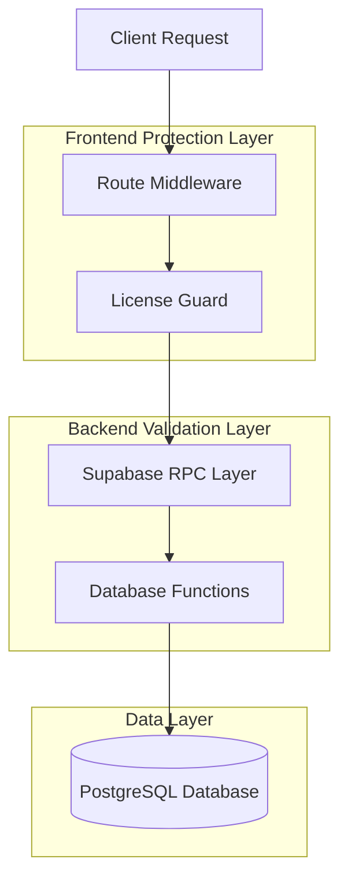
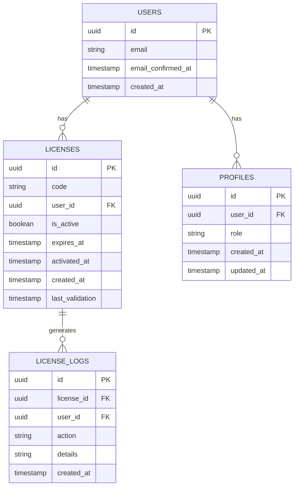

# Arquitetura Técnica - Sistema de Licenças Melhorado

## 1. Arquitetura Design

```mermaid
graph TD
    A[User Browser] --> B[React Frontend Application]
    B --> C[Route Middleware]
    C --> D[License Guard Component]
    D --> E[Supabase SDK]
    E --> F[Supabase Service]
    
    subgraph "Frontend Layer"
        B
        C
        D
    end
    
    subgraph "Service Layer (Provided by Supabase)"
        F
        G[License Validation RPC]
        H[User Authentication]
        I[Database (PostgreSQL)]
    end
    
    F --> G
    F --> H
    F --> I
```

## 2. Technology Description

- Frontend: React@18 + TypeScript + tailwindcss@3 + vite
- Backend: Supabase (PostgreSQL + RPC Functions)
- Authentication: Supabase Auth
- State Management: React Hooks + Context API
- Routing: React Router v6
- Cache: Multi-tab cache service

## 3. Route Definitions

| Route | Purpose | License Required | Access Level |
|-------|---------|------------------|-------------|
| / | Home page, landing page | No | Public |
| /auth | Authentication page | No | Public |
| /signup | User registration | No | Public |
| /licenca | License management page | No | Authenticated Only |
| /dashboard | Main dashboard | Yes | Full Access |
| /painel | Alternative dashboard | Yes | Full Access |
| /service-orders | Service orders management | Yes | Full Access |
| /service-orders/* | Service orders sub-pages | Yes | Full Access |
| /central-de-ajuda | Help center | Yes | Full Access |
| /admin | Administrative panel | Yes | Admin Only |

## 4. API Definitions

### 4.1 Core API

**License Validation**
```
RPC: validate_user_license_complete
```

Request:
| Param Name | Param Type | isRequired | Description |
|------------|------------|------------|-------------|
| user_id | uuid | true | The ID of the user to validate |

Response:
| Param Name | Param Type | Description |
|------------|------------|-------------|
| has_license | boolean | Whether user has a license |
| is_valid | boolean | Whether the license is currently valid |
| license_code | string | The license code (if exists) |
| expires_at | timestamp | License expiration date |
| message | string | Status message |

**License Activation**
```
RPC: activate_license_enhanced
```

Request:
| Param Name | Param Type | isRequired | Description |
|------------|------------|------------|-------------|
| license_code | string | true | The license code to activate |
| p_user_id | uuid | true | The user ID to associate with license |

Response:
| Param Name | Param Type | Description |
|------------|------------|-------------|
| success | boolean | Whether activation was successful |
| message | string | Success or error message |
| error_type | string | Type of error if failed |

## 5. Server Architecture Diagram



## 6. Data Model

### 6.1 Data Model Definition



### 6.2 Data Definition Language

**Licenses Table (Enhanced)**
```sql
-- Enhanced licenses table with tracking fields
ALTER TABLE public.licenses 
ADD COLUMN IF NOT EXISTS activated_at TIMESTAMP WITH TIME ZONE,
ADD COLUMN IF NOT EXISTS last_validation TIMESTAMP WITH TIME ZONE DEFAULT NOW();

-- Create index for performance
CREATE INDEX IF NOT EXISTS idx_licenses_user_active ON public.licenses(user_id, is_active);
CREATE INDEX IF NOT EXISTS idx_licenses_code ON public.licenses(code);
CREATE INDEX IF NOT EXISTS idx_licenses_expires_at ON public.licenses(expires_at);

-- License validation function
CREATE OR REPLACE FUNCTION public.validate_user_license_complete(p_user_id uuid)
RETURNS TABLE(
  has_license boolean,
  is_valid boolean,
  license_code text,
  expires_at timestamp with time zone,
  activated_at timestamp with time zone,
  days_remaining integer,
  message text,
  requires_activation boolean,
  requires_renewal boolean,
  expired_at timestamp with time zone,
  timestamp timestamp with time zone
)
LANGUAGE plpgsql
SECURITY DEFINER
AS $$
DECLARE
  license_record public.licenses%ROWTYPE;
  current_time timestamp with time zone := NOW();
BEGIN
  -- Search for active license
  SELECT * INTO license_record
  FROM public.licenses
  WHERE user_id = p_user_id 
  AND is_active = TRUE
  ORDER BY activated_at DESC
  LIMIT 1;
  
  -- Update last validation timestamp
  IF FOUND THEN
    UPDATE public.licenses 
    SET last_validation = current_time
    WHERE id = license_record.id;
  END IF;
  
  -- Return validation result
  RETURN QUERY
  SELECT 
    FOUND as has_license,
    CASE 
      WHEN NOT FOUND THEN FALSE
      WHEN license_record.expires_at IS NULL THEN TRUE
      WHEN license_record.expires_at > current_time THEN TRUE
      ELSE FALSE
    END as is_valid,
    COALESCE(license_record.code, '') as license_code,
    license_record.expires_at,
    license_record.activated_at,
    CASE 
      WHEN license_record.expires_at IS NULL THEN NULL
      ELSE GREATEST(0, EXTRACT(days FROM (license_record.expires_at - current_time))::integer)
    END as days_remaining,
    CASE 
      WHEN NOT FOUND THEN 'Nenhuma licença encontrada'
      WHEN license_record.expires_at IS NULL THEN 'Licença ativa (sem expiração)'
      WHEN license_record.expires_at > current_time THEN 'Licença válida'
      ELSE 'Licença expirada'
    END as message,
    NOT FOUND as requires_activation,
    CASE 
      WHEN NOT FOUND THEN FALSE
      WHEN license_record.expires_at IS NULL THEN FALSE
      ELSE license_record.expires_at <= current_time
    END as requires_renewal,
    CASE 
      WHEN license_record.expires_at IS NULL THEN NULL
      WHEN license_record.expires_at <= current_time THEN license_record.expires_at
      ELSE NULL
    END as expired_at,
    current_time as timestamp;
END;
$$;

-- Grant permissions
GRANT EXECUTE ON FUNCTION public.validate_user_license_complete(uuid) TO authenticated;
GRANT SELECT ON public.licenses TO authenticated;
GRANT UPDATE ON public.licenses TO authenticated;
```

## 7. License Access Control Implementation

### 7.1 Frontend Route Protection Strategy

**Enhanced Route Middleware Configuration:**
```typescript
// Updated route configuration for license-based access
export const ENHANCED_ROUTE_CONFIG = {
  // Routes accessible only with valid license
  licenseRequiredRoutes: [
    '/dashboard',
    '/painel', 
    '/service-orders',
    '/service-orders/*',
    '/central-de-ajuda',
    '/msg'
  ],
  
  // Routes accessible without license (authenticated users only)
  licenseExemptRoutes: [
    '/licenca',
    '/reset-email'
  ],
  
  // Public routes (no authentication required)
  publicRoutes: [
    '/',
    '/auth',
    '/signup',
    '/plans',
    '/privacy',
    '/terms'
  ],
  
  // Redirect destinations based on license status
  redirects: {
    noLicense: '/licenca',
    expiredLicense: '/licenca',
    invalidLicense: '/licenca',
    unauthenticated: '/auth'
  }
};
```

### 7.2 License Guard Component

**Component Structure:**
```typescript
interface LicenseGuardProps {
  children: React.ReactNode;
  requiresLicense?: boolean;
  fallbackComponent?: React.ComponentType;
  redirectTo?: string;
}

// License verification states
type LicenseStatus = 
  | 'loading'
  | 'valid'
  | 'expired' 
  | 'invalid'
  | 'none';
```

### 7.3 User Experience Flow

**Access Control Messages:**
```typescript
const LICENSE_MESSAGES = {
  expired: {
    title: 'Licença Expirada',
    description: 'Sua licença expirou. Renove para continuar usando todas as funcionalidades.',
    action: 'Renovar Licença'
  },
  invalid: {
    title: 'Licença Inválida', 
    description: 'Sua licença não é válida. Entre em contato com o suporte.',
    action: 'Contatar Suporte'
  },
  none: {
    title: 'Licença Necessária',
    description: 'Você precisa de uma licença válida para acessar esta funcionalidade.',
    action: 'Ativar Licença'
  }
};
```

## 8. Implementation Phases

### Phase 1: Backend Enhancement
- Enhance license validation RPC functions
- Add license status tracking
- Implement audit logging

### Phase 2: Frontend Route Protection
- Update route middleware with license checks
- Implement LicenseGuard component
- Add user-friendly restriction messages

### Phase 3: User Experience
- Enhance license page with clear status indicators
- Add contextual help and contact options
- Implement smooth navigation for licensed users

### Phase 4: Testing & Monitoring
- Comprehensive testing of all access scenarios
- Performance monitoring of license checks
- User feedback collection and iteration

## 9. Security Considerations

- License validation occurs on both frontend and backend
- RPC functions use SECURITY DEFINER for controlled access
- Rate limiting prevents abuse of license validation
- Audit trails track all license-related actions
- Multi-tab synchronization ensures consistent state

## 10. Performance Optimizations

- Intelligent caching of license status
- Batch license validations where possible
- Optimized database queries with proper indexing
- Minimal re-renders through efficient state management
- Background license status refresh