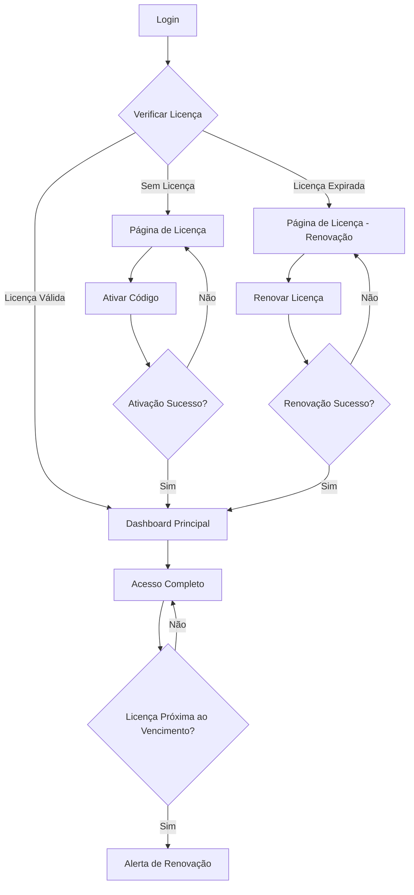

# Sistema de Licenças Melhorado - Documento de Requisitos do Produto

## 1. Product Overview

Sistema de controle de acesso baseado em licenças que restringe funcionalidades do OneDrip conforme o status da licença do usuário. O sistema garante que apenas usuários com licenças válidas tenham acesso completo às funcionalidades, enquanto usuários sem licença ou com licenças expiradas são direcionados para a seção de gerenciamento de licenças.

O produto resolve o problema de controle de acesso e monetização, permitindo que apenas usuários licenciados utilizem as funcionalidades premium do sistema de gestão de assistências técnicas.

## 2. Core Features

### 2.1 User Roles

| Role | Registration Method | Core Permissions |
|------|---------------------|------------------|
| Usuário Sem Licença | Email registration | Acesso apenas à seção /licenca, pode ativar licenças |
| Usuário com Licença Expirada | Usuário existente com licença vencida | Acesso apenas à seção /licenca, pode renovar licenças |
| Usuário com Licença Ativa | Usuário com licença válida | Acesso completo a todas as funcionalidades do sistema |
| Administrador | Usuário com role admin | Acesso completo + gerenciamento de licenças de outros usuários |

### 2.2 Feature Module

Nosso sistema de licenças consiste nas seguintes páginas principais:

1. **Página de Licença (/licenca)**: verificação de status, ativação de códigos, informações de contato para suporte.
2. **Dashboard Principal (/dashboard)**: painel principal com acesso completo para usuários licenciados.
3. **Páginas Protegidas**: todas as funcionalidades do sistema que requerem licença válida.
4. **Páginas de Autenticação**: login, registro e verificação de email.
5. **Páginas Públicas**: landing page, termos de uso, política de privacidade.

### 2.3 Page Details

| Page Name | Module Name | Feature description |
|-----------|-------------|---------------------|
| Página de Licença | Status Display | Exibir status atual da licença, data de expiração, código da licença |
| Página de Licença | License Activation | Permitir inserção e ativação de novos códigos de licença |
| Página de Licença | Contact Support | Botões para contato via WhatsApp e email com informações pré-preenchidas |
| Página de Licença | Renewal Options | Opções claras para renovação de licenças expiradas |
| Dashboard Principal | Access Control | Verificar licença antes de renderizar conteúdo principal |
| Dashboard Principal | License Status Widget | Widget mostrando status da licença e dias restantes |
| Route Middleware | License Validation | Interceptar navegação e validar licença antes de permitir acesso |
| Route Middleware | Redirect Logic | Redirecionar usuários sem licença para /licenca automaticamente |
| Route Middleware | Cache Management | Gerenciar cache de status de licença para performance |
| License Guard Component | Access Restriction | Bloquear renderização de componentes para usuários sem licença |
| License Guard Component | Fallback UI | Exibir mensagens informativas quando acesso é negado |
| Notification System | License Alerts | Alertas sobre expiração próxima ou licença inválida |
| Notification System | Success Messages | Confirmações de ativação e renovação de licenças |

## 3. Core Process

### Fluxo para Usuário Sem Licença:
1. Usuário faz login no sistema
2. Sistema verifica status da licença
3. Usuário é redirecionado para /licenca
4. Usuário visualiza opções de ativação
5. Usuário insere código de licença ou contata suporte
6. Após ativação bem-sucedida, usuário é redirecionado para dashboard

### Fluxo para Usuário com Licença Expirada:
1. Usuário tenta acessar funcionalidade protegida
2. Sistema detecta licença expirada
3. Usuário é redirecionado para /licenca com mensagem específica
4. Usuário visualiza informações da licença expirada
5. Usuário pode renovar via novo código ou contatar suporte
6. Após renovação, acesso completo é restaurado

### Fluxo para Usuário com Licença Ativa:
1. Usuário navega normalmente pelo sistema
2. Sistema valida licença em background
3. Usuário tem acesso completo a todas as funcionalidades
4. Sistema exibe alertas próximo à data de expiração
5. Usuário pode renovar proativamente antes do vencimento

## 4. User Interface Design

### 4.1 Design Style

- **Cores Primárias**: Azul (#3B82F6) para elementos de licença válida, Âmbar (#F59E0B) para alertas de expiração
- **Cores Secundárias**: Vermelho (#EF4444) para licenças expiradas/inválidas, Verde (#10B981) para sucessos
- **Estilo de Botões**: Rounded corners (8px), sombras sutis, estados hover bem definidos
- **Fontes**: Inter para textos gerais, JetBrains Mono para códigos de licença
- **Layout**: Card-based design com espaçamento generoso, navegação top-level
- **Ícones**: Lucide icons com estilo outline, Shield para licenças, Key para ativação

### 4.2 Page Design Overview

| Page Name | Module Name | UI Elements |
|-----------|-------------|-------------|
| Página de Licença | Status Display | Card com ícone de escudo, badge colorido para status, tipografia hierárquica |
| Página de Licença | License Input | Input field com validação em tempo real, botão primary destacado |
| Página de Licença | Contact Section | Botões com ícones do WhatsApp e email, cores da marca de cada serviço |
| Dashboard | License Widget | Mini-card no header com status compacto, progress bar para dias restantes |
| Route Protection | Fallback UI | Tela de bloqueio com ilustração, mensagem clara e call-to-action |
| Notifications | Alert System | Toast notifications com ícones apropriados, auto-dismiss configurável |

### 4.3 Responsiveness

O sistema é mobile-first com adaptação completa para desktop. Inclui otimizações para touch interaction, especialmente nos botões de contato e ativação de licença. O layout se adapta de single-column no mobile para multi-column no desktop, mantendo a hierarquia visual.

## 5. Functional Requirements

### 5.1 License Validation Requirements
- Validação deve ocorrer em tempo real durante a navegação
- Cache inteligente para evitar validações excessivas
- Fallback graceful em caso de falha na validação
- Sincronização entre múltiplas abas do navegador

### 5.2 Access Control Requirements
- Bloqueio imediato de acesso a funcionalidades protegidas
- Redirecionamento automático para página de licença
- Preservação da URL de destino para redirecionamento pós-ativação
- Mensagens contextuais baseadas no tipo de restrição

### 5.3 User Experience Requirements
- Tempo de resposta máximo de 2 segundos para validação
- Feedback visual imediato para todas as ações
- Processo de ativação em no máximo 3 cliques
- Informações de contato sempre visíveis na página de licença

### 5.4 Security Requirements
- Validação dupla (frontend + backend) para todas as verificações
- Rate limiting para prevenir abuso do sistema de validação
- Audit trail completo de todas as ações relacionadas a licenças
- Proteção contra bypass de restrições via manipulação de URL

## 6. Technical Constraints

### 6.1 Performance Constraints
- Validação de licença não deve impactar tempo de carregamento inicial
- Cache deve ser invalidado automaticamente em mudanças de status
- Máximo de 1 validação por minuto por usuário em condições normais

### 6.2 Compatibility Constraints
- Suporte completo para navegadores modernos (Chrome 90+, Firefox 88+, Safari 14+)
- Funcionalidade offline limitada com cache local
- Compatibilidade com PWA para instalação mobile

### 6.3 Integration Constraints
- Integração completa com sistema de autenticação Supabase existente
- Compatibilidade com sistema de roles e permissões atual
- Preservação de funcionalidades administrativas existentes

## 7. Success Metrics

### 7.1 User Engagement Metrics
- Taxa de ativação de licenças: > 80% dos usuários que acessam /licenca
- Tempo médio para ativação: < 2 minutos
- Taxa de renovação: > 70% das licenças próximas ao vencimento

### 7.2 Technical Performance Metrics
- Tempo de resposta da validação: < 500ms no percentil 95
- Disponibilidade do sistema: > 99.5%
- Taxa de erro em validações: < 1%

### 7.3 Business Metrics
- Redução de uso não autorizado: > 95%
- Aumento na conversão para licenças pagas: > 25%
- Redução em tickets de suporte relacionados a acesso: > 40%