# Sistema de Redirecionamento Automático para Licenças Inativas

## 1. Visão Geral do Sistema

Este documento detalha a implementação de um sistema robusto de redirecionamento automático que direciona exclusivamente usuários com licença inativa para a rota `/verify-licenca`, garantindo segurança, performance e experiência do usuário otimizada.

### 1.1 Objetivos Principais
- Interceptar automaticamente usuários com licenças inativas
- Bloquear acesso às rotas protegidas `/painel` e `/dashboard`
- Redirecionar transparentemente para `/verify-licenca`
- Manter fluxo normal para licenças ativas
- Implementar medidas de segurança robustas

## 2. Arquitetura Técnica

### 2.1 Diagrama de Arquitetura

```mermaid
graph TD
    A[Usuário Acessa Rota] --> B[RouteMiddleware]
    B --> C{Rota Pública?}
    C -->|Sim| D[Acesso Permitido]
    C -->|Não| E[Verificar Autenticação]
    E --> F{Usuário Autenticado?}
    F -->|Não| G[Redirecionar para /auth]
    F -->|Sim| H[Verificar Email]
    H --> I{Email Confirmado?}
    I -->|Não| J[Tela de Confirmação]
    I -->|Sim| K[Verificar Licença]
    K --> L{Licença Ativa?}
    L -->|Sim| M[Acesso Permitido]
    L -->|Não| N[Redirecionar para /verify-licenca]
    
    subgraph "Camadas de Proteção"
        B
        O[UnifiedProtectionGuard]
        P[LicenseGuard]
    end
    
    subgraph "Cache e Performance"
        Q[MultiTabCache]
        R[NavigationState]
    end
```



### 2.2 Componentes Principais

#### 2.2.1 RouteMiddleware (Existente - Melhorias)
**Localização:** `src/middleware/routeMiddleware.ts`

**Funcionalidades Atuais:**
- ✅ Verificação de autenticação
- ✅ Verificação de email confirmado
- ✅ Verificação básica de licença
- ✅ Cache multi-tab
- ✅ Redirecionamento para `/verify-licenca`

**Melhorias Necessárias:**
```typescript
// Adicionar ao método canAccessRoute
async canAccessRoute(path: string, forceRefresh = false): Promise<{
  canAccess: boolean;
  redirectTo?: string;
  reason?: string;
  licenseStatus?: 'active' | 'inactive' | 'expired' | 'not_found';
}> {
  // ... código existente ...
  
  // Verificação aprimorada de licença
  if (requiresLicense(path) && path !== '/licenca' && path !== '/verify-licenca') {
    const licenseCheck = await this.checkLicenseStatus(state.user.id);
    
    if (licenseCheck.status === 'inactive') {
      // Log de tentativa de acesso não autorizado
      this.logUnauthorizedAccess(state.user.id, path, 'inactive_license');
      
      return {
        canAccess: false,
        redirectTo: '/verify-licenca',
        reason: 'Licença inativa - redirecionando para verificação'
        licenseStatus: 'inactive'
      };
    }
  }
}

// Novo método para verificação detalhada de licença
private async checkLicenseStatus(userId: string): Promise<{
  status: 'active' | 'inactive' | 'expired' | 'not_found';
  expiresAt?: string;
  lastCheck: number;
}> {
  try {
    const { data: license } = await supabase
      .from('licenses')
      .select('is_active, expires_at, updated_at')
      .eq('user_id', userId)
      .single();
    
    if (!license) {
      return { status: 'not_found', lastCheck: Date.now() };
    }
    
    // Verificar se expirou
    if (license.expires_at && new Date(license.expires_at) < new Date()) {
      return { 
        status: 'expired', 
        expiresAt: license.expires_at,
        lastCheck: Date.now() 
      };
    }
    
    return {
      status: license.is_active ? 'active' : 'inactive',
      expiresAt: license.expires_at,
      lastCheck: Date.now()
    };
  } catch (error) {
    console.error('Erro ao verificar status da licença:', error);
    return { status: 'not_found', lastCheck: Date.now() };
  }
}

// Método para log de tentativas não autorizadas
private logUnauthorizedAccess(userId: string, attemptedPath: string, reason: string): void {
  // Implementar log assíncrono
  setTimeout(async () => {
    try {
      await supabase.from('access_logs').insert({
        user_id: userId,
        attempted_path: attemptedPath,
        reason: reason,
        timestamp: new Date().toISOString(),
        user_agent: navigator.userAgent
      });
    } catch (error) {
      console.warn('Falha ao registrar tentativa de acesso:', error);
    }
  }, 0);
}
```

#### 2.2.2 UnifiedProtectionGuard (Existente - Melhorias)
**Localização:** `src/components/UnifiedProtectionGuard.tsx`

**Melhorias Necessárias:**
```typescript
// Adicionar verificação em tempo real de licença
useEffect(() => {
  if (!user) return;
  
  // Verificar licença a cada 5 minutos para usuários ativos
  const licenseCheckInterval = setInterval(async () => {
    try {
      const result = await routeMiddleware.canAccessRoute(location.pathname, true);
      
      if (!result.canAccess && result.licenseStatus === 'inactive') {
        // Invalidar sessão e redirecionar
        routeMiddleware.invalidateState();
        setProtectionState({
          isLoading: false,
          canAccess: false,
          redirectTo: '/verify-licenca',
          reason: 'Licença desativada durante a sessão'
        });
      }
    } catch (error) {
      console.error('Erro na verificação periódica de licença:', error);
    }
  }, 5 * 60 * 1000); // 5 minutos
  
  return () => clearInterval(licenseCheckInterval);
}, [user, location.pathname]);
```

#### 2.2.3 Novo Componente: LicenseStatusMonitor
**Localização:** `src/components/LicenseStatusMonitor.tsx`

```typescript
import { useEffect, useRef } from 'react';
import { useAuth } from '../hooks/useAuth';
import { routeMiddleware } from '../middleware/routeMiddleware';
import { supabase } from '../lib/supabase';

interface LicenseStatusMonitorProps {
  onLicenseStatusChange?: (status: 'active' | 'inactive') => void;
}

export const LicenseStatusMonitor: React.FC<LicenseStatusMonitorProps> = ({
  onLicenseStatusChange
}) => {
  const { user } = useAuth();
  const lastStatusRef = useRef<string | null>(null);
  const monitorIntervalRef = useRef<NodeJS.Timeout>();
  
  useEffect(() => {
    if (!user) return;
    
    // Monitoramento em tempo real via Supabase Realtime
    const subscription = supabase
      .channel('license_changes')
      .on(
        'postgres_changes',
        {
          event: 'UPDATE',
          schema: 'public',
          table: 'licenses',
          filter: `user_id=eq.${user.id}`
        },
        (payload) => {
          const newLicense = payload.new as any;
          const currentStatus = newLicense.is_active ? 'active' : 'inactive';
          
          if (lastStatusRef.current !== currentStatus) {
            lastStatusRef.current = currentStatus;
            
            // Invalidar cache do middleware
            routeMiddleware.invalidateState();
            
            // Notificar mudança
            onLicenseStatusChange?.(currentStatus);
            
            // Se licença foi desativada, forçar verificação
            if (currentStatus === 'inactive') {
              window.location.href = '/verify-licenca';
            }
          }
        }
      )
      .subscribe();
    
    return () => {
      subscription.unsubscribe();
      if (monitorIntervalRef.current) {
        clearInterval(monitorIntervalRef.current);
      }
    };
  }, [user, onLicenseStatusChange]);
  
  return null; // Componente invisível
};
```

## 3. Fluxo de Dados e Processos

### 3.1 Fluxo de Autenticação e Verificação

```mermaid
sequenceDiagram
    participant U as Usuário
    participant A as App
    participant RM as RouteMiddleware
    participant S as Supabase
    participant C as Cache
    
    U->>A: Acessa /painel
    A->>RM: canAccessRoute('/painel')
    RM->>C: Buscar estado cached
    
    alt Cache válido
        C-->>RM: Estado cached
    else Cache inválido
        RM->>S: Verificar usuário
        RM->>S: Verificar licença
        S-->>RM: Dados atualizados
        RM->>C: Atualizar cache
    end
    
    RM->>RM: Avaliar permissões
    
    alt Licença ativa
        RM-->>A: { canAccess: true }
        A->>U: Renderizar /painel
    else Licença inativa
        RM->>S: Log tentativa não autorizada
        RM-->>A: { canAccess: false, redirectTo: '/verify-licenca' }
        A->>U: Redirecionar para /verify-licenca
    end
```



### 3.2 Monitoramento em Tempo Real

```mermaid
sequenceDiagram
    participant A as Admin
    participant S as Supabase
    participant LSM as LicenseStatusMonitor
    participant U as Usuário
    
    A->>S: Desativar licença do usuário
    S->>LSM: Realtime notification
    LSM->>LSM: Detectar mudança de status
    LSM->>U: Redirecionar para /verify-licenca
    LSM->>S: Invalidar cache
```



## 4. Implementação de Segurança

### 4.1 Medidas Anti-Contorno

#### 4.1.1 Validação em Múltiplas Camadas
```typescript
// 1. Middleware de Rota (Primeira linha de defesa)
// 2. Componente de Proteção (Segunda linha)
// 3. Hooks de Verificação (Terceira linha)
// 4. API Guards (Quarta linha)

// Exemplo de API Guard
export const withLicenseValidation = (handler: NextApiHandler) => {
  return async (req: NextApiRequest, res: NextApiResponse) => {
    const token = req.headers.authorization?.replace('Bearer ', '');
    
    if (!token) {
      return res.status(401).json({ error: 'Token não fornecido' });
    }
    
    try {
      const { data: { user } } = await supabase.auth.getUser(token);
      
      if (!user) {
        return res.status(401).json({ error: 'Token inválido' });
      }
      
      // Verificar licença diretamente no banco
      const { data: license } = await supabase
        .from('licenses')
        .select('is_active')
        .eq('user_id', user.id)
        .single();
      
      if (!license?.is_active) {
        return res.status(403).json({ 
          error: 'Licença inativa',
          redirectTo: '/verify-licenca'
        });
      }
      
      return handler(req, res);
    } catch (error) {
      return res.status(500).json({ error: 'Erro interno' });
    }
  };
};
```

#### 4.1.2 Invalidação de Sessão
```typescript
// Método para invalidar sessão quando licença é desativada
export const invalidateUserSession = async (userId: string) => {
  try {
    // 1. Invalidar cache local
    routeMiddleware.invalidateState();
    
    // 2. Revogar tokens de refresh (se possível)
    await supabase.auth.admin.signOut(userId);
    
    // 3. Limpar localStorage/sessionStorage
    if (typeof window !== 'undefined') {
      localStorage.removeItem('supabase.auth.token');
      sessionStorage.clear();
    }
    
    // 4. Forçar redirecionamento
    window.location.href = '/verify-licenca';
  } catch (error) {
    console.error('Erro ao invalidar sessão:', error);
  }
};
```

### 4.2 Proteção Contra Manipulação

#### 4.2.1 Verificação de Integridade
```typescript
// Hash de verificação para detectar manipulação de dados
const generateStateHash = (state: NavigationState): string => {
  const data = {
    userId: state.user?.id,
    hasValidLicense: state.hasValidLicense,
    timestamp: Math.floor(Date.now() / 60000) // Minuto atual
  };
  
  return btoa(JSON.stringify(data));
};

const validateStateIntegrity = (state: NavigationState, hash: string): boolean => {
  const expectedHash = generateStateHash(state);
  return expectedHash === hash;
};
```

## 5. Otimização de Performance

### 5.1 Estratégias de Cache

#### 5.1.1 Cache Inteligente
```typescript
// Configuração de cache otimizada
const cacheConfig = {
  // Cache de estado de navegação
  navigationState: {
    ttl: 5 * 60 * 1000, // 5 minutos
    maxSize: 100,
    strategy: 'lru' // Least Recently Used
  },
  
  // Cache de verificação de licença
  licenseStatus: {
    ttl: 2 * 60 * 1000, // 2 minutos
    maxSize: 50,
    strategy: 'fifo' // First In, First Out
  },
  
  // Cache de rotas públicas
  publicRoutes: {
    ttl: 30 * 60 * 1000, // 30 minutos
    maxSize: 200,
    strategy: 'lru'
  }
};
```

#### 5.1.2 Pré-carregamento Inteligente
```typescript
// Pré-carregar dados de licença em rotas críticas
const preloadLicenseData = async (userId: string) => {
  try {
    const licensePromise = supabase
      .from('licenses')
      .select('is_active, expires_at')
      .eq('user_id', userId)
      .single();
    
    // Não aguardar, apenas iniciar o carregamento
    licensePromise.then(({ data }) => {
      if (data) {
        // Armazenar em cache para uso futuro
        multiTabCache.set(`license_${userId}`, data, 2 * 60 * 1000);
      }
    });
  } catch (error) {
    // Falha silenciosa no pré-carregamento
    console.debug('Pré-carregamento de licença falhou:', error);
  }
};
```

### 5.2 Debouncing e Throttling

```typescript
// Debounce para verificações de rota
const debouncedRouteCheck = debounce(async (path: string) => {
  return await routeMiddleware.canAccessRoute(path);
}, 100);

// Throttle para verificações de licença em tempo real
const throttledLicenseCheck = throttle(async (userId: string) => {
  return await checkLicenseStatus(userId);
}, 30000); // Máximo uma vez a cada 30 segundos
```

## 6. Experiência do Usuário

### 6.1 Feedback Visual

#### 6.1.1 Estados de Carregamento
```typescript
// Componente de loading otimizado
const LicenseVerificationLoader: React.FC = () => {
  const [message, setMessage] = useState('Verificando licença...');
  
  useEffect(() => {
    const messages = [
      'Verificando licença...',
      'Validando permissões...',
      'Carregando dados...'
    ];
    
    let index = 0;
    const interval = setInterval(() => {
      index = (index + 1) % messages.length;
      setMessage(messages[index]);
    }, 1500);
    
    return () => clearInterval(interval);
  }, []);
  
  return (
    <div className="flex items-center justify-center min-h-screen">
      <div className="text-center">
        <div className="animate-spin rounded-full h-8 w-8 border-b-2 border-primary mx-auto mb-4"></div>
        <p className="text-muted-foreground">{message}</p>
      </div>
    </div>
  );
};
```

#### 6.1.2 Mensagens de Redirecionamento
```typescript
// Componente de redirecionamento com feedback
const LicenseRedirectNotice: React.FC<{ reason: string }> = ({ reason }) => {
  const [countdown, setCountdown] = useState(3);
  
  useEffect(() => {
    const timer = setInterval(() => {
      setCountdown(prev => {
        if (prev <= 1) {
          window.location.href = '/verify-licenca';
          return 0;
        }
        return prev - 1;
      });
    }, 1000);
    
    return () => clearInterval(timer);
  }, []);
  
  return (
    <div className="fixed inset-0 bg-black/50 flex items-center justify-center z-50">
      <div className="bg-white rounded-lg p-6 max-w-md mx-4">
        <div className="text-center">
          <AlertTriangle className="h-12 w-12 text-amber-500 mx-auto mb-4" />
          <h3 className="text-lg font-semibold mb-2">Acesso Restrito</h3>
          <p className="text-muted-foreground mb-4">{reason}</p>
          <p className="text-sm text-muted-foreground">
            Redirecionando em {countdown} segundos...
          </p>
        </div>
      </div>
    </div>
  );
};
```

### 6.2 Transparência do Processo

#### 6.2.1 Log de Atividades para o Usuário
```typescript
// Componente para mostrar histórico de verificações
const LicenseActivityLog: React.FC = () => {
  const [activities, setActivities] = useState<ActivityLog[]>([]);
  
  useEffect(() => {
    const loadActivities = async () => {
      try {
        const { data } = await supabase
          .from('user_activity_logs')
          .select('*')
          .eq('user_id', user?.id)
          .order('created_at', { ascending: false })
          .limit(10);
        
        setActivities(data || []);
      } catch (error) {
        console.error('Erro ao carregar atividades:', error);
      }
    };
    
    loadActivities();
  }, []);
  
  return (
    <div className="bg-card rounded-lg p-4">
      <h4 className="font-medium mb-3">Atividade Recente</h4>
      <div className="space-y-2">
        {activities.map(activity => (
          <div key={activity.id} className="flex items-center gap-3 text-sm">
            <div className="w-2 h-2 bg-primary rounded-full"></div>
            <span className="text-muted-foreground">
              {new Date(activity.created_at).toLocaleString()}
            </span>
            <span>{activity.description}</span>
          </div>
        ))}
      </div>
    </div>
  );
};
```

## 7. Monitoramento e Logs

### 7.1 Sistema de Logs

#### 7.1.1 Estrutura da Tabela de Logs
```sql
-- Tabela para logs de acesso
CREATE TABLE access_logs (
  id UUID PRIMARY KEY DEFAULT gen_random_uuid(),
  user_id UUID REFERENCES auth.users(id),
  attempted_path VARCHAR(255) NOT NULL,
  reason VARCHAR(255) NOT NULL,
  timestamp TIMESTAMP WITH TIME ZONE DEFAULT NOW(),
  user_agent TEXT,
  ip_address INET,
  session_id VARCHAR(255),
  created_at TIMESTAMP WITH TIME ZONE DEFAULT NOW()
);

-- Índices para performance
CREATE INDEX idx_access_logs_user_id ON access_logs(user_id);
CREATE INDEX idx_access_logs_timestamp ON access_logs(timestamp DESC);
CREATE INDEX idx_access_logs_reason ON access_logs(reason);

-- Tabela para logs de atividade do usuário
CREATE TABLE user_activity_logs (
  id UUID PRIMARY KEY DEFAULT gen_random_uuid(),
  user_id UUID REFERENCES auth.users(id),
  action VARCHAR(100) NOT NULL,
  description TEXT,
  metadata JSONB,
  created_at TIMESTAMP WITH TIME ZONE DEFAULT NOW()
);

-- RLS (Row Level Security)
ALTER TABLE access_logs ENABLE ROW LEVEL SECURITY;
ALTER TABLE user_activity_logs ENABLE ROW LEVEL SECURITY;

-- Políticas de acesso
CREATE POLICY "Users can view their own access logs" ON access_logs
  FOR SELECT USING (auth.uid() = user_id);

CREATE POLICY "Users can view their own activity logs" ON user_activity_logs
  FOR SELECT USING (auth.uid() = user_id);
```

#### 7.1.2 Implementação do Logger
```typescript
class SecurityLogger {
  private static instance: SecurityLogger;
  private logQueue: LogEntry[] = [];
  private isProcessing = false;
  
  static getInstance(): SecurityLogger {
    if (!SecurityLogger.instance) {
      SecurityLogger.instance = new SecurityLogger();
    }
    return SecurityLogger.instance;
  }
  
  async logUnauthorizedAccess(data: {
    userId: string;
    attemptedPath: string;
    reason: string;
    userAgent?: string;
    sessionId?: string;
  }) {
    const logEntry: LogEntry = {
      type: 'unauthorized_access',
      timestamp: new Date().toISOString(),
      ...data
    };
    
    this.logQueue.push(logEntry);
    this.processQueue();
  }
  
  async logLicenseStatusChange(data: {
    userId: string;
    oldStatus: string;
    newStatus: string;
    triggeredBy?: string;
  }) {
    const logEntry: LogEntry = {
      type: 'license_status_change',
      timestamp: new Date().toISOString(),
      ...data
    };
    
    this.logQueue.push(logEntry);
    this.processQueue();
  }
  
  private async processQueue() {
    if (this.isProcessing || this.logQueue.length === 0) return;
    
    this.isProcessing = true;
    
    try {
      const batch = this.logQueue.splice(0, 10); // Processar em lotes
      
      await Promise.all(batch.map(entry => this.persistLog(entry)));
    } catch (error) {
      console.error('Erro ao processar logs:', error);
      // Recolocar na fila em caso de erro
      this.logQueue.unshift(...batch);
    } finally {
      this.isProcessing = false;
      
      // Processar próximo lote se houver
      if (this.logQueue.length > 0) {
        setTimeout(() => this.processQueue(), 1000);
      }
    }
  }
  
  private async persistLog(entry: LogEntry) {
    try {
      if (entry.type === 'unauthorized_access') {
        await supabase.from('access_logs').insert({
          user_id: entry.userId,
          attempted_path: entry.attemptedPath,
          reason: entry.reason,
          timestamp: entry.timestamp,
          user_agent: entry.userAgent,
          session_id: entry.sessionId
        });
      } else if (entry.type === 'license_status_change') {
        await supabase.from('user_activity_logs').insert({
          user_id: entry.userId,
          action: 'license_status_change',
          description: `Licença alterada de ${entry.oldStatus} para ${entry.newStatus}`,
          metadata: {
            old_status: entry.oldStatus,
            new_status: entry.newStatus,
            triggered_by: entry.triggeredBy
          }
        });
      }
    } catch (error) {
      console.error('Erro ao persistir log:', error);
      throw error;
    }
  }
}

export const securityLogger = SecurityLogger.getInstance();
```

## 8. Testes e Validação

### 8.1 Casos de Teste

#### 8.1.1 Testes de Redirecionamento
```typescript
describe('Sistema de Redirecionamento de Licença', () => {
  describe('Usuário com licença inativa', () => {
    it('deve redirecionar de /painel para /verify-licenca', async () => {
      // Setup: usuário autenticado com licença inativa
      const mockUser = { id: 'user-1', email_confirmed_at: new Date() };
      const mockLicense = { is_active: false, user_id: 'user-1' };
      
      // Mock do Supabase
      jest.spyOn(supabase.auth, 'getUser').mockResolvedValue({ data: { user: mockUser } });
      jest.spyOn(supabase.from('licenses'), 'select').mockReturnValue({
        eq: jest.fn().mockReturnValue({
          single: jest.fn().mockResolvedValue({ data: mockLicense })
        })
      });
      
      // Teste
      const result = await routeMiddleware.canAccessRoute('/painel');
      
      // Verificações
      expect(result.canAccess).toBe(false);
      expect(result.redirectTo).toBe('/verify-licenca');
      expect(result.reason).toContain('Licença inativa');
    });
    
    it('deve registrar tentativa de acesso não autorizado', async () => {
      // Setup similar ao teste anterior
      const logSpy = jest.spyOn(securityLogger, 'logUnauthorizedAccess');
      
      // Teste
      await routeMiddleware.canAccessRoute('/dashboard');
      
      // Verificação
      expect(logSpy).toHaveBeenCalledWith({
        userId: 'user-1',
        attemptedPath: '/dashboard',
        reason: 'inactive_license'
      });
    });
  });
  
  describe('Usuário com licença ativa', () => {
    it('deve permitir acesso a rotas protegidas', async () => {
      // Setup: usuário autenticado com licença ativa
      const mockUser = { id: 'user-2', email_confirmed_at: new Date() };
      const mockLicense = { is_active: true, user_id: 'user-2' };
      
      // Mocks
      jest.spyOn(supabase.auth, 'getUser').mockResolvedValue({ data: { user: mockUser } });
      jest.spyOn(supabase.from('licenses'), 'select').mockReturnValue({
        eq: jest.fn().mockReturnValue({
          single: jest.fn().mockResolvedValue({ data: mockLicense })
        })
      });
      
      // Teste
      const result = await routeMiddleware.canAccessRoute('/painel');
      
      // Verificação
      expect(result.canAccess).toBe(true);
      expect(result.redirectTo).toBeUndefined();
    });
  });
});
```

#### 8.1.2 Testes de Performance
```typescript
describe('Performance do Sistema', () => {
  it('deve responder em menos de 100ms para verificações com cache', async () => {
    // Setup: popular cache
    await routeMiddleware.canAccessRoute('/painel');
    
    // Teste
    const startTime = performance.now();
    await routeMiddleware.canAccessRoute('/painel');
    const endTime = performance.now();
    
    // Verificação
    expect(endTime - startTime).toBeLessThan(100);
  });
  
  it('deve lidar com 100 verificações simultâneas', async () => {
    const promises = Array.from({ length: 100 }, () => 
      routeMiddleware.canAccessRoute('/dashboard')
    );
    
    const startTime = performance.now();
    const results = await Promise.all(promises);
    const endTime = performance.now();
    
    // Verificações
    expect(results).toHaveLength(100);
    expect(endTime - startTime).toBeLessThan(5000); // 5 segundos
  });
});
```

## 9. Implementação Passo a Passo

### 9.1 Fase 1: Melhorias no Middleware (Semana 1)
1. ✅ Analisar código existente
2. 🔄 Implementar verificação aprimorada de licença
3. 🔄 Adicionar sistema de logs
4. 🔄 Implementar cache otimizado
5. 🔄 Testes unitários

### 9.2 Fase 2: Monitoramento em Tempo Real (Semana 2)
1. 🔄 Criar componente LicenseStatusMonitor
2. 🔄 Implementar Supabase Realtime
3. 🔄 Adicionar invalidação de sessão
4. 🔄 Testes de integração

### 9.3 Fase 3: Melhorias de UX (Semana 3)
1. 🔄 Implementar feedback visual
2. 🔄 Adicionar mensagens de redirecionamento
3. 🔄 Criar log de atividades para usuário
4. 🔄 Testes de usabilidade

### 9.4 Fase 4: Segurança e Otimização (Semana 4)
1. 🔄 Implementar medidas anti-contorno
2. 🔄 Adicionar verificação de integridade
3. 🔄 Otimizar performance
4. 🔄 Testes de segurança
5. 🔄 Deploy e monitoramento

## 10. Considerações de Segurança

### 10.1 Checklist de Segurança
- [ ] Validação em múltiplas camadas
- [ ] Verificação de integridade de dados
- [ ] Logs de segurança abrangentes
- [ ] Invalidação de sessão em tempo real
- [ ] Proteção contra manipulação de cache
- [ ] Rate limiting para verificações
- [ ] Criptografia de dados sensíveis
- [ ] Auditoria de acesso

### 10.2 Monitoramento de Segurança
- Alertas para tentativas de contorno
- Dashboard de métricas de segurança
- Relatórios de atividade suspeita
- Análise de padrões de acesso

## 11. Métricas e KPIs

### 11.1 Métricas de Performance
- Tempo de resposta de verificação: < 100ms (cached), < 500ms (fresh)
- Taxa de cache hit: > 80%
- Throughput: > 1000 verificações/segundo

### 11.2 Métricas de Segurança
- Tentativas de acesso não autorizado: monitorar tendências
- Taxa de falsos positivos: < 1%
- Tempo de detecção de licença inativa: < 5 segundos

### 11.3 Métricas de UX
- Tempo de redirecionamento: < 3 segundos
- Taxa de abandono pós-redirecionamento: < 10%
- Satisfação do usuário: > 4.5/5

## 12. Conclusão

Este sistema de redirecionamento automático para licenças inativas fornece uma solução robusta, segura e otimizada que:

1. **Garante Segurança**: Múltiplas camadas de validação e proteção contra contorno
2. **Otimiza Performance**: Cache inteligente e verificações eficientes
3. **Melhora UX**: Feedback claro e redirecionamentos transparentes
4. **Facilita Monitoramento**: Logs abrangentes e métricas detalhadas
5. **Permite Escalabilidade**: Arquitetura preparada para crescimento

A implementação seguirá uma abordagem incremental, permitindo testes e ajustes em cada fase, garantindo uma transição suave e confiável para o novo sistema.