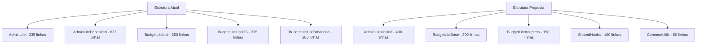

# Guia Técnico de Refatoração - Onedrip

## 1. Arquitetura de Refatoração

### 1.1 Estrutura Atual vs Proposta



### 1.2 Padrões de Design Aplicados

#### Composition over Inheritance
```typescript
// Base component com composição
interface BaseComponentProps {
  children?: React.ReactNode;
  variant?: 'standard' | 'enhanced' | 'ios';
}

const BaseComponent = ({ children, variant, ...props }: BaseComponentProps) => {
  const config = useVariantConfig(variant);
  return (
    <div className={config.containerClass}>
      {children}
    </div>
  );
};
```

#### Factory Pattern para Componentes
```typescript
const ComponentFactory = {
  admin: (props: AdminProps) => {
    return props.enhanced ? 
      <AdminLiteUnified {...props} enhanced /> :
      <AdminLiteUnified {...props} />;
  },
  
  budgetList: (props: BudgetListProps) => {
    const AdapterComponent = BudgetListAdapters[props.variant];
    return <AdapterComponent {...props} />;
  }
};
```

## 2. Implementação Detalhada

### 2.1 AdminLiteUnified - Consolidação

#### Interface Unificada
```typescript
interface AdminLiteUnifiedProps {
  userId: string;
  onBack: () => void;
  enhanced?: boolean;
  profile?: any;
  features?: {
    analytics?: boolean;
    bulkOperations?: boolean;
    exportData?: boolean;
    advancedFilters?: boolean;
  };
}

interface AdminTab {
  id: string;
  label: string;
  icon: React.ComponentType;
  component: React.ComponentType<any>;
  requiresEnhanced?: boolean;
}
```

#### Configuração de Tabs Dinâmica
```typescript
const useAdminTabs = (enhanced: boolean): AdminTab[] => {
  return useMemo(() => {
    const baseTabs: AdminTab[] = [
      {
        id: 'users',
        label: 'Usuários',
        icon: Users,
        component: UserManagementSection
      },
      {
        id: 'licenses',
        label: 'Licenças',
        icon: Key,
        component: AdminLicenseManagerEnhanced
      },
      {
        id: 'vip',
        label: 'VIP',
        icon: Settings,
        component: VipUserManagement
      },
      {
        id: 'game',
        label: 'Jogo',
        icon: Gamepad2,
        component: GameSettingsPanel
      }
    ];

    if (enhanced) {
      baseTabs.push(
        {
          id: 'analytics',
          label: 'Analytics',
          icon: BarChart3,
          component: UserAnalytics,
          requiresEnhanced: true
        },
        {
          id: 'logs',
          label: 'Logs',
          icon: Shield,
          component: AdminLogs,
          requiresEnhanced: true
        }
      );
    }

    return baseTabs;
  }, [enhanced]);
};
```

#### Hook de Dados Administrativos
```typescript
export const useAdminData = (enhanced = false) => {
  const {
    searchTerm,
    setSearchTerm,
    selectedUser,
    setSelectedUser,
    isEditModalOpen,
    setIsEditModalOpen,
    userToDelete,
    setUserToDelete,
    userToRenew,
    setUserToRenew,
    debugInfo,
    users,
    isLoading,
    error,
    deleteUserMutation,
    renewUserLicenseMutation,
    filteredUsers,
    handleEdit,
    handleDelete,
    handleRenew,
    confirmDelete,
    confirmRenewal
  } = useUserManagement();

  // Enhanced features
  const enhancedFeatures = useMemo(() => {
    if (!enhanced) return {};
    
    return {
      bulkOperations: useBulkOperations(users),
      analytics: useUserAnalytics(users),
      exportData: useDataExport(users)
    };
  }, [enhanced, users]);

  const stats = useMemo(() => {
    if (!users) return { totalUsers: 0, activeUsers: 0, expiredUsers: 0, adminUsers: 0 };
    
    const now = new Date();
    return {
      totalUsers: users.length,
      activeUsers: users.filter(user => 
        user.license_active && new Date(user.expiration_date) > now
      ).length,
      expiredUsers: users.filter(user => 
        !user.license_active || new Date(user.expiration_date) <= now
      ).length,
      adminUsers: enhanced ? users.filter(user => user.role === 'admin').length : 0
    };
  }, [users, enhanced]);

  return {
    // Base features
    searchTerm,
    setSearchTerm,
    selectedUser,
    setSelectedUser,
    isEditModalOpen,
    setIsEditModalOpen,
    userToDelete,
    setUserToDelete,
    userToRenew,
    setUserToRenew,
    debugInfo,
    users,
    isLoading,
    error,
    deleteUserMutation,
    renewUserLicenseMutation,
    filteredUsers,
    handleEdit,
    handleDelete,
    handleRenew,
    confirmDelete,
    confirmRenewal,
    stats,
    
    // Enhanced features (conditional)
    ...enhancedFeatures
  };
};
```

### 2.2 BudgetList - Arquitetura Modular

#### Componente Base
```typescript
interface BudgetListBaseProps {
  variant: 'standard' | 'ios' | 'enhanced';
  userId: string;
  profile: any;
  onNavigateTo?: (view: string, id?: string) => void;
}

export const BudgetListBase = ({ variant, userId, profile, onNavigateTo }: BudgetListBaseProps) => {
  const config = useBudgetListConfig(variant);
  const { budgets, loading, error, handleRefresh } = useBudgetData(userId);
  const operations = useBudgetOperations(variant);
  const [searchTerm, debouncedSearchTerm, setSearchTerm] = useSearchWithDebounce();
  
  const filteredBudgets = useMemo(() => {
    return config.filterFunction(budgets, debouncedSearchTerm);
  }, [budgets, debouncedSearchTerm, config.filterFunction]);

  if (loading) return <config.LoadingComponent />;
  if (error) return <config.ErrorComponent error={error} onRetry={handleRefresh} />;

  return (
    <config.ContainerComponent>
      <config.SearchComponent 
        searchTerm={searchTerm}
        onSearchChange={setSearchTerm}
        onClearSearch={() => setSearchTerm('')}
      />
      
      <config.ListComponent
        budgets={filteredBudgets}
        operations={operations}
        profile={profile}
        onNavigateTo={onNavigateTo}
      />
    </config.ContainerComponent>
  );
};
```

#### Configurações por Variante
```typescript
const useBudgetListConfig = (variant: 'standard' | 'ios' | 'enhanced') => {
  return useMemo(() => {
    const configs = {
      standard: {
        ContainerComponent: StandardContainer,
        SearchComponent: BudgetLiteSearch,
        ListComponent: StandardBudgetList,
        LoadingComponent: StandardSkeleton,
        ErrorComponent: StandardError,
        filterFunction: standardFilter
      },
      ios: {
        ContainerComponent: IOSContainer,
        SearchComponent: IOSSearchInput,
        ListComponent: IOSBudgetList,
        LoadingComponent: IOSSkeleton,
        ErrorComponent: IOSError,
        filterFunction: iosFilter
      },
      enhanced: {
        ContainerComponent: EnhancedContainer,
        SearchComponent: EnhancedSearch,
        ListComponent: EnhancedBudgetList,
        LoadingComponent: EnhancedSkeleton,
        ErrorComponent: EnhancedError,
        filterFunction: enhancedFilter
      }
    };
    
    return configs[variant];
  }, [variant]);
};
```

#### Hook de Operações Unificado
```typescript
export const useBudgetOperations = (variant: 'standard' | 'ios' | 'enhanced') => {
  const { handleSingleDeletion, isDeleting } = useBudgetDeletion();
  const { toast } = useToast();
  
  const handleShareWhatsApp = useCallback(async (budget: any) => {
    try {
      const { data: fullBudget, error } = await supabase
        .from('budgets')
        .select('*')
        .eq('id', budget.id)
        .single();

      const budgetData = error ? budget : fullBudget;
      const message = generateWhatsAppMessage({
        ...budgetData,
        part_quality: budgetData.part_quality || budgetData.part_type || 'Reparo'
      });
      
      shareViaWhatsApp(message);
      toast({
        title: "Redirecionando...",
        description: "Você será redirecionado para o WhatsApp."
      });
    } catch (error) {
      toast({
        title: "Erro ao compartilhar",
        description: "Ocorreu um erro ao preparar o compartilhamento.",
        variant: "destructive"
      });
    }
  }, [toast]);

  const handleDelete = useCallback(async (budget: any) => {
    try {
      if (variant === 'ios') {
        // iOS specific deletion with audit
        const { data, error } = await supabase.rpc('soft_delete_budget_with_audit', {
          p_budget_id: budget.id,
          p_deletion_reason: 'Exclusão via interface mobile iOS'
        });
        
        if (error || !data?.success) {
          throw new Error(data?.error || 'Falha na exclusão do orçamento');
        }
      } else {
        // Standard deletion
        await handleSingleDeletion({ budgetId: budget.id });
      }
    } catch (error) {
      console.error('Erro ao deletar orçamento:', error);
      throw error;
    }
  }, [variant, handleSingleDeletion]);

  const handleEdit = useCallback((budget: any) => {
    // Variant-specific edit logic
    switch (variant) {
      case 'ios':
        // iOS specific navigation
        break;
      case 'enhanced':
        // Enhanced edit features
        break;
      default:
        // Standard edit
        break;
    }
  }, [variant]);

  return {
    handleShareWhatsApp,
    handleDelete,
    handleEdit,
    isDeleting
  };
};
```

### 2.3 Hooks Compartilhados

#### useSearchWithDebounce
```typescript
export const useSearchWithDebounce = (initialValue = '', delay = 300) => {
  const [searchTerm, setSearchTerm] = useState(initialValue);
  const [debouncedSearchTerm, setDebouncedSearchTerm] = useState(initialValue);
  
  useEffect(() => {
    const timer = setTimeout(() => {
      setDebouncedSearchTerm(searchTerm);
    }, delay);
    
    return () => clearTimeout(timer);
  }, [searchTerm, delay]);
  
  const clearSearch = useCallback(() => {
    setSearchTerm('');
    setDebouncedSearchTerm('');
  }, []);
  
  return [searchTerm, debouncedSearchTerm, setSearchTerm, clearSearch] as const;
};
```

#### useVariantConfig
```typescript
export const useVariantConfig = (variant: string) => {
  return useMemo(() => {
    const configs = {
      standard: {
        containerClass: 'p-4',
        cardClass: 'bg-card border rounded-lg p-4',
        buttonClass: 'bg-primary text-primary-foreground'
      },
      ios: {
        containerClass: 'min-h-[100dvh] bg-background text-foreground',
        cardClass: 'bg-card/50 backdrop-blur-sm border rounded-xl p-4',
        buttonClass: 'bg-blue-500 text-white rounded-full'
      },
      enhanced: {
        containerClass: 'p-4 space-y-4',
        cardClass: 'bg-gradient-to-r from-card to-card/80 border rounded-lg p-4',
        buttonClass: 'bg-gradient-to-r from-primary to-primary/80 text-primary-foreground'
      }
    };
    
    return configs[variant] || configs.standard;
  }, [variant]);
};
```

## 3. Utilitários Consolidados

### 3.1 Funções de Formatação
```typescript
export const formatUtils = {
  date: (dateString: string) => {
    return new Date(dateString).toLocaleDateString('pt-BR', {
      day: '2-digit',
      month: '2-digit',
      year: 'numeric'
    });
  },
  
  currency: (value: number) => {
    return new Intl.NumberFormat('pt-BR', {
      style: 'currency',
      currency: 'BRL'
    }).format(value);
  },
  
  licenseStatus: (user: any) => {
    if (!user.expiration_date) return 'Sem licença';
    const now = new Date();
    const expiresAt = new Date(user.expiration_date);
    if (expiresAt > now) {
      const daysLeft = Math.ceil((expiresAt.getTime() - now.getTime()) / (1000 * 60 * 60 * 24));
      return `${daysLeft} dias restantes`;
    }
    return 'Expirada';
  }
};
```

### 3.2 Constantes Compartilhadas
```typescript
export const ADMIN_TABS = {
  USERS: 'users',
  LICENSES: 'licenses',
  VIP: 'vip',
  GAME: 'game',
  ANALYTICS: 'analytics',
  LOGS: 'logs'
} as const;

export const BUDGET_VARIANTS = {
  STANDARD: 'standard',
  IOS: 'ios',
  ENHANCED: 'enhanced'
} as const;

export const STATUS_COLORS = {
  ACTIVE: 'bg-green-500/20 text-green-900 dark:text-green-200',
  EXPIRED: 'bg-red-500/20 text-red-900 dark:text-red-200',
  PENDING: 'bg-yellow-500/20 text-yellow-900 dark:text-yellow-200',
  INACTIVE: 'bg-gray-500/20 text-gray-900 dark:text-gray-200'
} as const;
```

## 4. Migração Gradual

### 4.1 Estratégia de Feature Flags
```typescript
// Feature flags para migração gradual
const useFeatureFlags = () => {
  return {
    useUnifiedAdmin: process.env.REACT_APP_USE_UNIFIED_ADMIN === 'true',
    useUnifiedBudgetList: process.env.REACT_APP_USE_UNIFIED_BUDGET_LIST === 'true',
    enablePerformanceOptimizations: process.env.REACT_APP_ENABLE_PERF_OPTS === 'true'
  };
};

// Wrapper para migração gradual
export const AdminLiteWrapper = (props: AdminLiteProps) => {
  const { useUnifiedAdmin } = useFeatureFlags();
  
  return useUnifiedAdmin ? 
    <AdminLiteUnified {...props} /> : 
    props.enhanced ? 
      <AdminLiteEnhanced {...props} /> : 
      <AdminLite {...props} />;
};
```

### 4.2 Testes de Compatibilidade
```typescript
// Hook para validar compatibilidade
const useCompatibilityCheck = (componentName: string) => {
  useEffect(() => {
    const startTime = performance.now();
    
    return () => {
      const endTime = performance.now();
      const renderTime = endTime - startTime;
      
      // Log performance metrics
      console.log(`${componentName} render time: ${renderTime}ms`);
      
      // Report to analytics if needed
      if (renderTime > 1000) {
        console.warn(`Slow render detected in ${componentName}`);
      }
    };
  }, [componentName]);
};
```

## 5. Benefícios Técnicos

### 5.1 Redução de Bundle Size
- **Antes**: ~1843 linhas nos componentes principais
- **Depois**: ~900 linhas estimadas
- **Redução**: ~51% no código dos componentes principais

### 5.2 Melhoria na Manutenibilidade
- **Single Source of Truth**: Lógica centralizada
- **Composição**: Componentes mais flexíveis
- **Testabilidade**: Hooks isolados e testáveis
- **TypeScript**: Interfaces bem definidas

### 5.3 Performance
- **Memoização**: Redução de re-renders desnecessários
- **Debounce**: Pesquisas mais eficientes
- **Lazy Loading**: Carregamento sob demanda
- **Code Splitting**: Bundles menores

Esta arquitetura de refatoração mantém 100% das funcionalidades existentes enquanto reduz significativamente a complexidade e melhora a manutenibilidade do código.